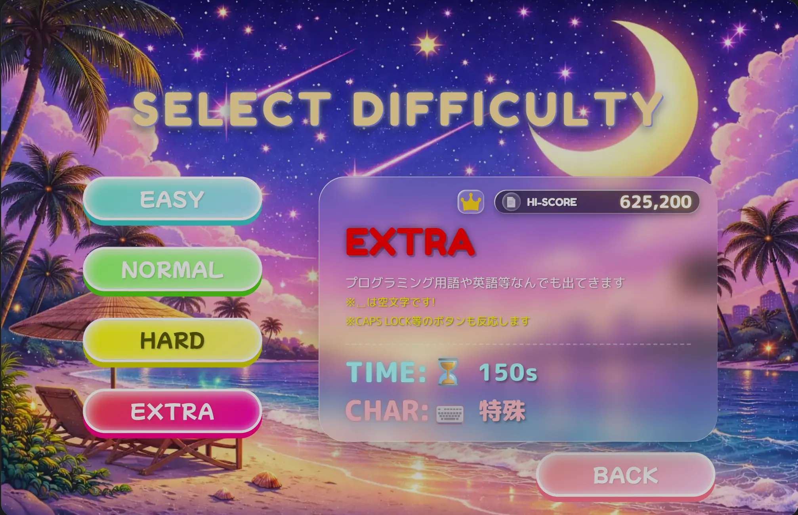
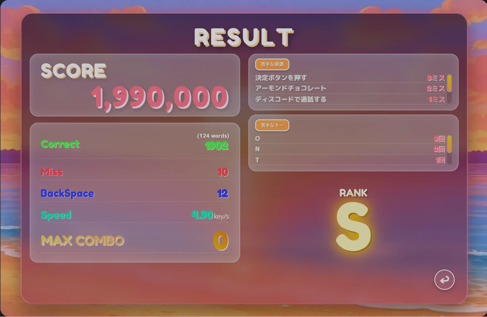
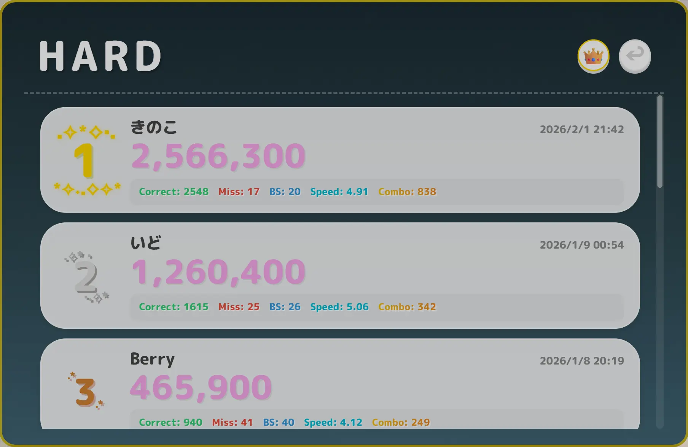
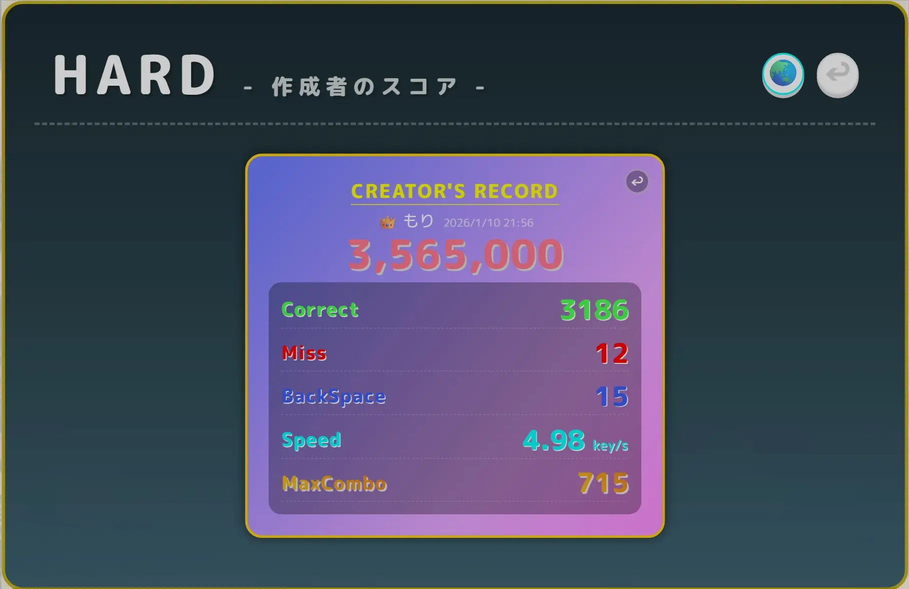
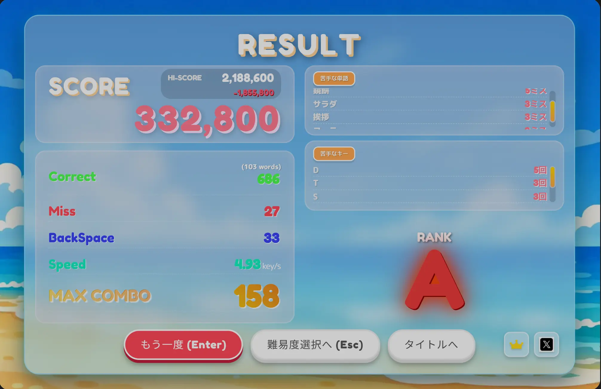
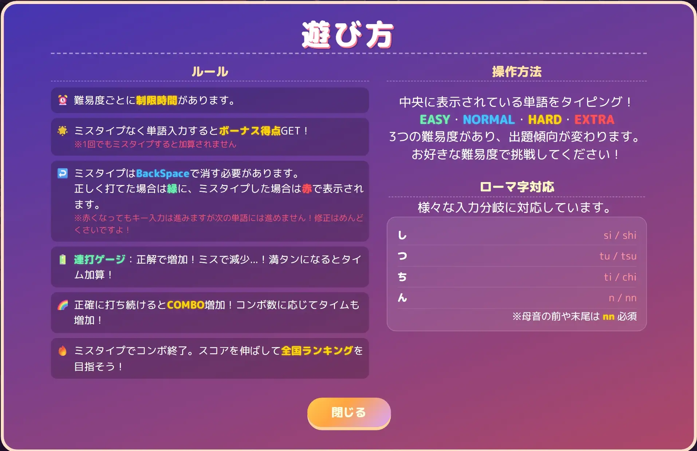
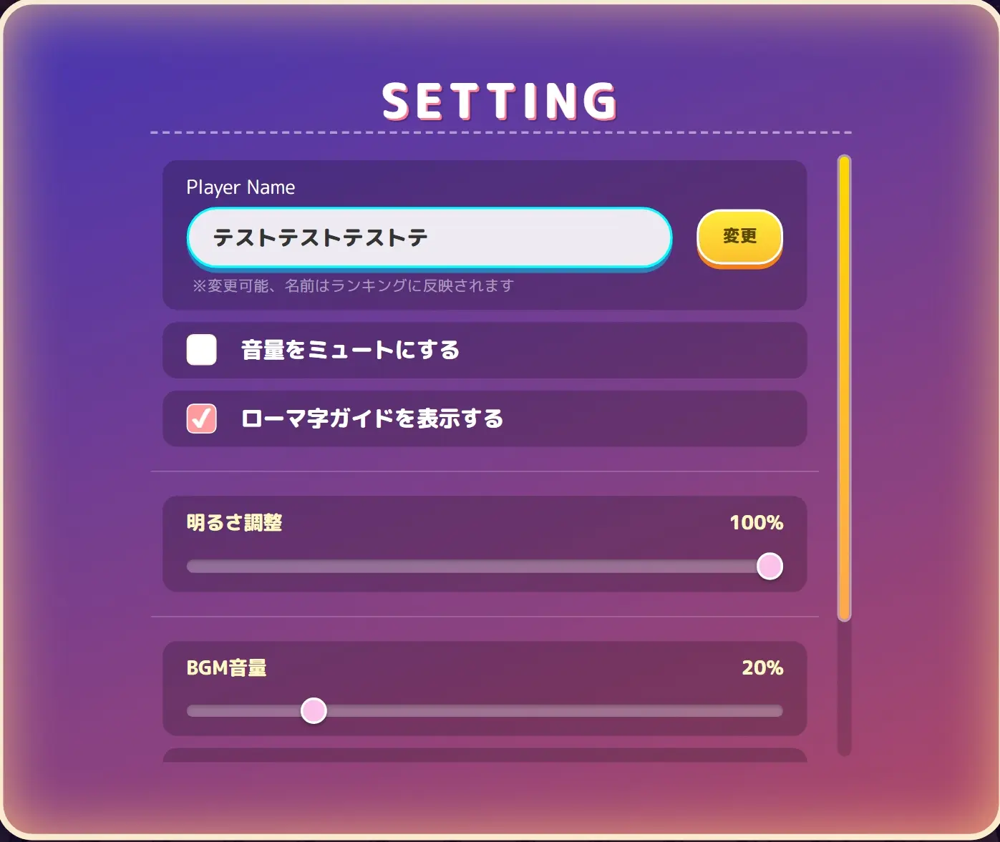
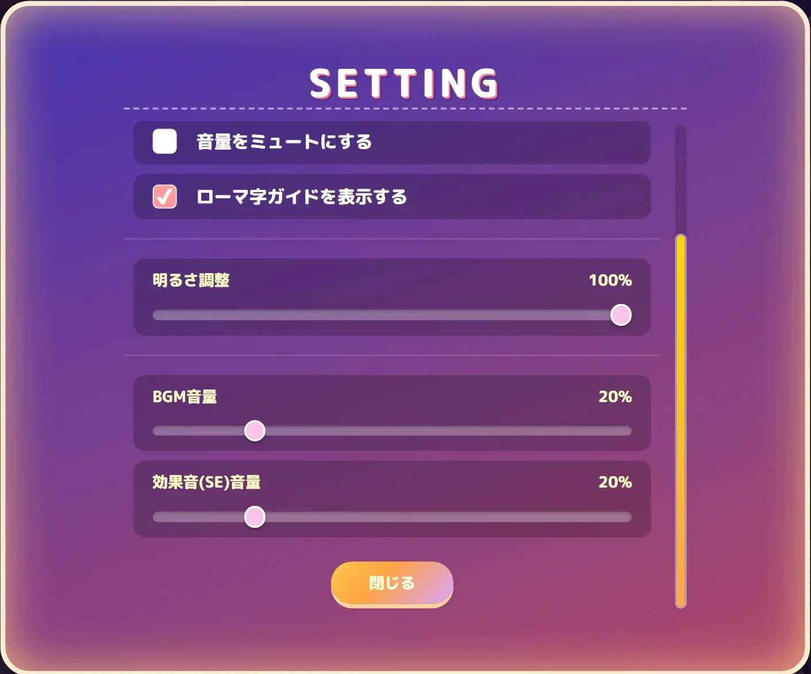

# 🌙 CRITICAL TYPING 🌙

https://github.com/user-attachments/assets/aeb8b6c2-9415-4c85-a0cc-e5637062761f

**正確性 × 継続性を重視した実戦的かつ爽快感のあるポップなタイピングゲーム**

## 📖 概要

「ミスタイプを改善し、実務で使えるタイピングスキルを身につける」ことを目的とした実践型タイピングゲームです。
既存のゲームにある「ミスしたら次の文字に進まない」仕様ではなく、**あえて「自分で BackSpace 押して修正しないと次の単語に進めない」実戦的な仕様**を採用。
一方で、音ゲーの要素（スコア性、コンボシステムや演出）を取り入れることで、「爽快感」と「中毒性のある楽しさ」を追求しました。

## 🔗 URL

- **App**: https://typing-game-eta-lime.vercel.app/
- **Repository**: https://github.com/mori-3-desu/Typing-game
- **記事も公開しています**: https://qiita.com/mori-3-desu

---

## 🎮 機能一覧 (Features)

### ⌨️ ゲームシステム (Game Logic)

- **実戦的な判定ロジック**:
  - 間違えた文字は赤字で残り続け、自分で **BackSpace** を押して消さない限り次の単語に進めません。
  - 「ミスタイプを自分で修正する」という、実務と同様のプロセスをゲーム化しました。
  - ミスタイプせずに単語を入力した際に、文字列ボーナスをスコアに加算することで正確性が重視されていることを体感できます。
- **爽快なコンボシステム**:
  - 正確に打ち続けることでコンボが加算され、コンボ数によって演出が追加されます。
  - コンボ継続によるタイムボーナスにより、正確性がスコアに直結します。
- **連打ゲージ**
  - 正確に打ち続けることで連打ゲージが加算されていき、MAX まで貯まるとタイムボーナスが加算されます。
  - ミスタイプすると大きく減少します。
- **入力分岐対応**:
  - ローマ字の多様な入力方式（ち：`ti`/`chi`、ん：`nn`/`n`など）に完全対応しています。

### 📊 画面構成

  <table>
    <tr>
      <td align="center"> 難易度選択</td>
      <td align="center"> ハイスコア詳細</td>
      <td align="center"> ランキング画面</td>
      <td align="center"> 開発者ランキング</td>
    </tr>
  </table>

- **難易度選択**:
  - 初心者から上級者まで楽しめるレベル設計。
  - `📄 アイコン`をクリックすることでハイスコア時のリザルト詳細を確認できます。
  - `王冠アイコン`をクリックすることで全国ランキングを確認できます。
  - より上級者向けにローマ字判定を抜いた特殊モード、**EXTRA**を追加！  
    こちらは英語やプログラミング言語をメインに**ローマ字が一切ないキー判定も  
    全て反応するシビアな仕様になっております！**  
    例えば、`CapsLock`を押したら**小文字と大文字が反転します**  
    現在調整段階ではありますが自身のある方は挑戦してみてください！

- **リザルト画面**  
  
  - `スコア`、`ミスタイプ`、`BackSpace`、`Speed`、`最大コンボ数`を表示。
  - `苦手だったキー`や`単語`を多い順に五つリストアップし、改善点を可視化します。
  - 以前の`ハイスコア`との差分を表示し、成長を実感できます。
  - スコアの値によって`ランク`が決まります。
- **ランキング機能**:
  - `Supabase` 連携によるリアルタイムランキング。
  - `上位ランカーのスコア`を目標にできます。
  - `開発者のスコア`も表示できる機能を実装しましたので参考にしたり目標設定にしたりすることで、**開発者とも競えるようにしています!**

### ⚙️ 設定・その他

- **遊び方**: ゲームの遊び方を記載！迷ったらいつでも見れます！
  
- **詳細設定**: `プレイヤー名変更機能`、`ミュート機能`、`ローマ字ガイドの ON/OFF`、`明るさ調整機能`、`BGM/SE` の個別音量調整。  
  
  
- **シェア機能**: リザルト画面にて`Xアイコン`をクリックして頂くと、ハイスコアを X（旧 Twitter）でポスト可能です！

---

## 🛠️ 使用技術 (Tech Stack)

**Frontend**  
   

**Backend / Infrastructure**  
 

**Testing / Tools**  
     

---

## 💡 技術選定とこだわり

### Frontend: React × TypeScript

- **保守性と拡張性**: 最初は JavaScript でフロントを作成し、状態管理と将来の機能拡張によるコードの複雑化が課題となり、保守性と拡張性を意識して React × TypeScript へ移行。
- **パフォーマンス最適化**:
  - ファーストビューに必要な画像を`preload`で優先ロード、
    その他の画像は起動時に一括プリロードし**ゲーム中の遅延表示を防止**
  - タイマーのクリーンアップを徹底し、**メモリリークの防止**
  - ランキングにてサーバー側でソート・リミットしてから返すことで**通信量削減**
- **TypeScript**
  - コードを書く段階で型を定義するため、**エラーを検出しバグを削減できる。**  
    **将来機能拡張していく際、堅牢なコード**となり、品質や安全性を確保できる。

### Backend: Supabase (BaaS)

- **開発効率とセキュリティ**:
  - `OSS-DB Silver` を取得したため、実際に扱ってみたかった。
  - 信頼性の高いツールに任せることによってバックエンド構築の工数を削減し、**UI/UX の向上にリソースを集中。**
  - **RLS (Row Level Security)** を設定し、データベース側でアクセス制御を行うことで、セキュアなランキングシステムを構築。
- **データの整合性**: PostgreSQL の厳格な型システムにより、バグの少ないデータ管理を実現しています。

### Build & Test: Vite / Vitest

- **高速な開発サイクル**: `HMR（Hot Module Replacement）`によるブラウザの即時反映で、開発の試行錯誤を効率的に。
- **品質保証**: Vite と相性が良い Vitest による単体テストを導入。将来的な機能追加やリファクタリング時にも**既存ロジックを壊さないための品質を担保。**

---

## 🎨 Credits & Special Thanks

**BGM**

- **しゃろう** 様 ("アトリエと電脳世界")
- **kyatto** 様 ("Secret-Adventure", "Stardust")
- **ふぁいの音楽置き場様** ("ぽかぽか日和")

**効果音**

- **効果音ラボ** 様
- **魔王魂** 様
- **Springin** 様

  ※記載漏れありましたら、ご連絡いただけると助かります 🙇‍♂️

**Reference**

- 既存の素晴らしいタイピングゲームや音楽ゲームの UI/UX を参考に、独自のアレンジを加えて開発いたしました。もしよろしければ一度遊んでみてください！
  フィードバックもお待ちしております！

---

## Release Notes

### ✨ News ✨

- **feat**: 新難易度**EXTRA**追加！
- **feat**: 明るさ機能調整追加！
- **fix**: リザルト画面クリック時ランク音が鳴ってしまう不具合を改善

### 📝 Future Plans 📝

- 難易度別ランキングの統合ビュー作成
- 全体の設計を見直し、だれが見ても分かりやすい構造にする。
- コードのリファクタリング（パフォーマンスと可読性の向上）
