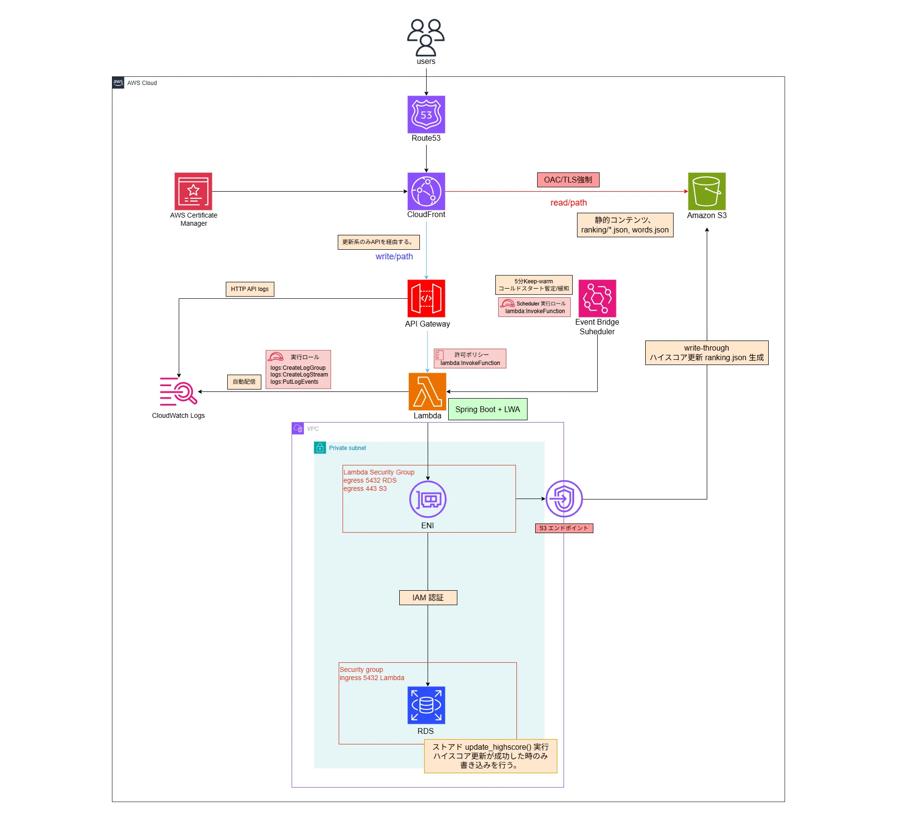

# 🌙 CRITICAL TYPING 🌙

https://github.com/user-attachments/assets/aeb8b6c2-9415-4c85-a0cc-e5637062761f

**正確性 × 継続性を重視した実戦的かつ爽快感のあるポップなタイピングゲーム**

## 📖 概要

「ミスタイプを改善し、実務で使えるタイピングスキルを身につける」ことを目的とした実践型タイピングゲームです。
既存のゲームにある「ミスしたら次の文字に進まない」仕様ではなく、**あえて「自分で BackSpace 押して修正しないと次の単語に進めない」実戦的な仕様**を採用。
一方で、音ゲーの要素（スコア性、コンボシステムや演出）を取り入れることで、「爽快感」と「中毒性のある楽しさ」を追求しました。

## 🔗 URL

- **App**: https://criticaltyping.net
- **Repository**: https://github.com/mori-3-desu/Typing-game
- **記事も公開しています**: https://qiita.com/mori-3-desu

---

## 🎮 機能一覧 (Features)

### ⌨️ ゲームシステム (Game Logic)

- **実戦的な判定ロジック**:
  - 間違えた文字は赤字で残り続け、自分で **BackSpace** を押して消さない限り次の単語に進めません。
  - 「ミスタイプを自分で修正する」という、実務と同様のプロセスをゲーム化しました。
  - ミスタイプせずに単語を入力した際に、文字列ボーナスをスコアに加算することで正確性が重視されていることを体感できます。
- **爽快なコンボシステム**:
  - 正確に打ち続けることでコンボが加算され、コンボ数によって演出が追加されます。
  - コンボ継続によるタイムボーナスにより、正確性がスコアに直結します。
- **連打ゲージ**
  - 正確に打ち続けることで連打ゲージが加算されていき、MAX まで貯まるとタイムボーナスが加算されます。
  - ミスタイプすると大きく減少します。
- **入力分岐対応**:
  - ローマ字の多様な入力方式（ち：`ti`/`chi`、ん：`nn`/`n`など）に完全対応しています。

### 📊 画面構成

  <table>
    <tr>
      <td align="center"> 難易度選択</td>
      <td align="center"> ハイスコア詳細</td>
      <td align="center"> ランキング画面</td>
      <td align="center"> 開発者ランキング</td>
    </tr>
  </table>

- **難易度選択**:
  - 初心者から上級者まで楽しめるレベル設計。
  - `📄 アイコン`をクリックすることでハイスコア時のリザルト詳細を確認できます。
  - `王冠アイコン`をクリックすることで全国ランキングを確認できます。
  - より上級者向けにローマ字判定を抜いた特殊モード、**EXTRA**を追加！  
    こちらは英語やプログラミング言語をメインに**ローマ字が一切ないキー判定も  
    全て反応するシビアな仕様になっております！**
    例えば、`CapsLock`を押したら**小文字と大文字が反転します**
    こちらは現在調整段階ではありますが自身のある方は挑戦してみてください！

- **リザルト画面**  
  
  - `スコア`、`ミスタイプ`、`BackSpace`、`Speed`、`最大コンボ数`を表示。
  - `苦手だったキー`や`単語`を多い順に五つリストアップし、改善点を可視化します。
  - 以前の`ハイスコア`との差分を表示し、成長を実感できます。
  - スコアの値によって`ランク`が決まります。
- **ランキング機能**:
  - リアルタイムランキングを搭載！上位を目指しながらタイピングスキルを極められます！
  - `上位ランカーのスコア`を目標にできます。
  - `開発者のスコア`も表示する機能を実装致しましたので参考にしたり目標設定にしたりすることで、**開発者とも競えるようにしています!**

### ⚙️ 設定・その他

- **遊び方**: ゲームの遊び方を記載！迷ったらいつでも見れます！  
  
- **詳細設定**: `プレイヤー名変更機能`、`ミュート機能`、`ローマ字ガイドの ON/OFF`、`明るさ調整機能`、`BGM/SE` の個別音量調整。  
  
  
- **シェア機能**: リザルト画面にて`Xアイコン`をクリックして頂くと、ハイスコアを X（旧 Twitter）でポスト可能です！

---

## 🛠️ 使用技術 (Tech Stack)

**Languages (言語)**

 

**Frameworks & Libraries (フレームワーク・ライブラリ)**

  

**Infrastructure & Cloud (インフラ・クラウド)**

 

**Build & Development Tools (ビルド・開発ツール)**

   

**Testing & Monitoring (テスト・監視)**

  

---

## 💡 技術選定とこだわり

### Frontend: React × TypeScript

- **保守性と拡張性**: 最初は JavaScript でフロントを作成し、状態管理と将来の機能拡張によるコードの複雑化が課題となり、保守性と拡張性を意識して React × TypeScript へ移行。
- **パフォーマンス最適化**:
  - ファーストビューに必要な画像を`preload`で優先ロード、
    その他の画像は起動時に一括プリロードし**ゲーム中の遅延表示を防止**
  - タイマーのクリーンアップを徹底し、**メモリリークの防止**
  - 読み取りを `S3` で静的配信を行い、`write through` 方式でランキング更新時、リアルタイムに反映される。読み取りと書き込みを分けることで読み取り時にはサーバーへの通信が行われないため、 **通信料** と **表示速度** を改善。
- **TypeScript**
  - 実行前に型の整合性をコンパイラがチェックする静的型付け言語。

  実行時には素の JavaScript に変換されるため、型の定義が削ぎ落されて無力になるが 、開発段階で型を定義することで**エラーを検出しバグを削減できる。****将来機能拡張していく際、堅牢なコード**となり、品質や安全性を確保できる。

---

### Backend / AWS を活用したインフラ構成

今回の構成はコストを最優先で抑えつつ、セキュアと管理コスト、パフォーマンスのバランスを意識し、約$20の範囲に抑えることが出来ました。

#### 実行時構成

#### VPCエンドポイントを全廃しつつ、セキュリティ強化とコストを削減
VPC Lambda から Supabase Auth へ接続してJWTを取得する構成を組んでいましたが問題が発生しました。
デプロイ構成が完成し、動作確認にて VPC Lambda が Supabase Auth へ接続できず、timeout が発生。原因調査を行った結果、VPC Lambda が外部インターネットへ接続する手段がなかった。

#### 何故気付かなかったのか
- VPCの仕組みの理解が甘かった
- 502 Bad Gateway が出ており、Supabase Auth 側に問題があると誤認していた。根本原因は VPC Lambda が外部へ接続する手段が無く、Lambda内のHTTPクライアントが接続待ちで timeout 。VPC Lambda が外部へ接続する手段が無いまま応答待ちを行っていた為、 **API Gateway** が 502 を返していた為、原因調査時に混乱してしまった。

#### 【解決策】
VPC Lambda が外部接続出来ないことをリリース前に気づき、設計の変更が求められている。この条件を満たす最適な構成を選択する。
- 現在 localstorage に token を保存してしまっているため Cookie(適切な設定を行う前提) へ認証情報を移行する。
- 管理コストよりコストを最優先する。
- ユーザー数はそれほど多くなく、リクエストの数や処理時間は数秒である。
- 移行完了時期は急いでない。

| 案 | 認証方式 | DB 接続・鍵管理 | 月額コスト | 実装コスト | 管理コスト | 根本解決 |
| :-: | --- | --- | :-: | :-: | :-: | :-: |
| **A** | JWT 自前 | Secret Manager（VPC エンドポイント経由）＋自動ローテーション | 〇 約 \$7 | △ | 〇 | ◎ |
| **B** | 外部 Auth（NAT Gateway 経由） | Secret Manager（VPC エンドポイント経由）＋自動ローテーション | ✕ 約 \$40 | ◎ | 〇 | ✕ |
| **C** | JWT 自前 | DB は IAM 認証（鍵レス）／JWT 署名鍵のみ CI/CD で注入・手動ローテーション | ◎ 無料 | △ | △ | ◎ |

> ◎ 優 / 〇 良 / △ 課題あり / ✕ 不可

今回は Frontend で localstorage に token が保存されているという問題が起きていた為、localstorage ではなくクッキーに保存し、外部Auth を利用しない方向で改善する目的とコストを最優先したため、 C の案を採用した。CI/CD 時に鍵を注入する構成へ。構成図には S3 Gatewayエンドポイントが存在するが、同一リージョン間なら無料の為、**実質エンドポイント全廃と全体的にバランスの取れた構成**となりました。

#### read/path と write/path を分けることでサーバー通信を抑える。
サーバー接続回数削減のため、GET リクエスト(単語とランキング機能)は S3 静的配信を行い、スコア送信と引継ぎコード、名前変更の POST 系(主に更新系メイン)はサーバーを経由する方式で読み書き非対称構成。これにより、**Lambdaのリソース節約と通信料節約**を実現。
- DBのコネクションプールを節約
- Lambdaの起動時間最適化

#### なぜこの構成か
- 単語データを取得を DB で行っていたが毎回タブを閉じて再開するときにロードが走ってしまう。  
- 更新頻度が少ないので S3 で静的配信にすることで Lambda のコールドスタートや DBクエリ 実行を待つ必要がなくなり、初回ロード分の通信と初期描画を高速化できる。
- ランキングも読み取りが多くなると予想。こちらも静的配信の構成へ。ただしこのままだとリアルタイム更新されないため、 S3 write throwgh方式を採用。スコア更新時に S3 のファイルも同時に書き換えることでユーザーには常に最新のランキングを提供し、Readのコストを最適化している。また POST はフロントで非同期で処理されるため、ユーザーの操作をブロックしない。  

ただし、リクエスト数が増加するとS3上書きとDB書き込みで実行時間が増加してしまう恐れがあるため、その際は設計を考える必要がある。今回はユーザー数とコストを考慮してこの構成を採用。

CQRS(コマンドクエリ責務分離) というアーキテクチャパターンを似ている。簡単にまとめるとデータの書き込みと読み込みを別々のモデルで処理するアーキテクチャパターン。

---

### CloudFrontとS3を活用した高速配信
- タイピングゲームは CloudFront + S3 を活用している。
- OACを活用してCloudFront経由以外のS3アクセスを禁止にしている。
- パブリックアクセスを完全に遮断し、TLS強制にすることでセキュリティを担保している。
- 万が一本番が失敗した際に旧バージョンに戻せるようにバージョニングを有効化し、旧環境へ戻せる構成にしている。
- ACLを無効化し、バケットポリシーで管理することでCloudFront以外は読めないように設定。
- 料金を抑えるためにPrice_Planを200にして日本のみの配信にしている。

#### なぜこの構成か
世界中のエッジロケーションにコンテンツがキャッシュされ、ユーザーに最も近い場所でデータが届くため、低遅延でコンテンツを配信できる。
- S3 はデータを取り出すたびに料金がかかるが、CloudFrontを活用することでデプロイ後のコンテンツをキャッシュ(デプロイ構成にてインバリデーションが必要)し、 S3 へのリクエストを削減してキャッシュからコンテンツを返す仕組みである。**データ料金だけでなく、CloudFront のエッジサーバー群がリクエストを分散する為、トラフィックが増えても耐えれる構成。**

OACとパブリックアクセスをブロックすることで CloudFront 外の不正アクセスを防ぐことが出来る。TLSをHTTPS強制にすることですることで自動でHTTPS通信へリダイレクトし、通信が暗号化され、セキュリティが向上する。
- OACを設定するとバケットポリシーで CloudFront のみバケットのオブジェクトを読み取る一時的な IAM権限 を付与することが出来る。パブリックアクセスでインターネット公開を禁止しながら CloudFront 経由以外のアクセスを禁止する設定が可能となる。

ACLを無効化することでアクセス権限をバケットポリシーで一元管理し、アクセス制御をバケットポリシーのみにすることで **開発者が誤ってファイルをインターネットに公開してしまう設定ミスを根本的に防ぐことが可能となる。**
- 以前の方式はファイルごとにアクセス権限を設定。この方法は管理が複雑になるだけでなく、設定ミスでファイルをインターネットへ公開してしまう危険性がある。

バージョニングを有効にすることで万が一本番環境で障害が起きてクラッシュした際でも旧環境へのフォールバックが可能となる。過去に一度動作していた実績ファイルの為、再ビルドによるエラーのリスクがなくなり、S3側で設定するだけで環境を戻せるため、**旧環境配信で稼働を維持でき、UX低下を抑制することが出来る。**  
またライフサイクルポリシーを設定し、30日後に削除することで不要なデータ保存料による課金増加を防ぐことが出来る。
- もし未設定だと本番環境で意図しないバグやクラッシュが発生した際に戻せなくなってしまう。GitHub 等で管理していたら以前のバージョンまで戻せるが、再度 CI/CD をまわす必要がある。  
新機能追加等でバージョンが進んでいた場合、以前の環境を探すのにも手間がかかり、外部パッケージのバージョンや依存関係が変わっていたりするとビルド失敗する可能性があり、復旧に時間がかかる。復旧に時間がかかるとクラッシュしたままのサイトを配信し続けることとなり、UX低下につながる。

Price_Class を 200 にして日本（アジア）のエッジロケーションを使用し配信遅延を防ぐことが出来る。  
また、地理的制限で日本のみにすることで日本国外からの不要なアクセスや、悪質なスキャンをエッジサーバーで即座に拒否することでボットによる無駄なデータ転送量を抑えることが出来る。

> 地理的制限はセキュリティを担保する目的だと誤解しやすい。本当の目的はデータ転送量やノイズ削減が目的。  
> Price_Plan は 100 のほうが安いがこちらは日本のエッジサーバーが使えないため注意

---

### 個人情報は扱わず、JWT 認証を活用し、セキュリティ強化と手軽に遊べるブラウザゲーム。ゲームデータはローカルストレージに保存して過去スコアを残せる構成
メールアドレス等の個人情報は扱わず、JWT 認証による本人確認で他人のデータ改ざん・なりすましを防止。サーバーレス構成で手軽に遊べるブラウザゲームを実現しています。認証情報（JWT）は HttpOnly Cookie、ゲームデータは localStorage と、機密性に応じて保存先を分離しました。脅威ごとの対策は以下の通りです。

| 脅威 | 対策 | 実際にしていること |
| --- | --- | --- |
| **XSS（成立させない）** | React の自動エスケープ ＋ CSP（CloudFront でヘッダー付与） | 不正なスクリプトの注入・実行をそもそも防ぐ（**防止の主役**） |
| **XSS（万一成立した時）** | HttpOnly Cookie | JS からトークンを読めず**持ち出しを阻止**（被害限定。XSS 自体は防げない） |
| **CSRF** | SameSite Cookie ＋ CSRF トークン | クロスサイトからの Cookie 自動送信を抑止し、リクエストの正当性を検証 |
| **なりすまし / 他人データ改ざん** | JWT 認証 ＋ サーバー側の認可チェック | 本人確認し、他人リソースの操作を拒否 |

#### 失敗談
Supabase を活用していた際、 RLS を活用し、行レベルでロックをかけることで自分以外のデータの書き換えを防止し、認証機能で Supabase Auth を活用することでバックエンドとインフラの開発コストを下げてフロントに注力できる構成を取っていた。RLSは設定できていたがtokenの設定が正しくできておらず、ローカルストレージにトークン情報が書き込まれてしまった。XSSのリスクが高まるため、外部 Auth をやめて JWT を自前実装し、適切なCookie設定をすることでセキュリティが向上した。実装コストは上がったが、localStorage トークン問題を解決した。

---

### SpringBoot + Lambda Web Adapter を活用
AWS移行前は Java + Railway の構成で運用していた。移行の計画段階では 無料枠のクレジットもあったため App Runner を活用した自動運用を図っておりましたがサービスが終了してしまったため、代替案として以下の三点から絞った。  

※ 個人開発という観点とユーザー数とリクエスト数を加味した評価としております。どちらも増大した場合、評価や設計が変わる可能性がございます。

| 構成案 | 管理コスト | 実装コスト | コスト | 本番安定度 | 採用 |
| :-- | :-: | :-: | :-: | :-: | :-: |
| **Lambda Web Adapter** | 〇 | ◎ | ◎ | △ | ✅ |
| **EC2 + ALB** | △ | △ | △ | 〇 | — |
| **ECS Express Mode** | ◎ | ◎ | △ | ◎ | — |

> ◎ 優 / 〇 良 / △ 課題あり / ✕ 不可
- 実装コストと料金では Lambda Web Adapter。ただしコールドスタートが課題。Snap Startは今回の構成だと非対応。
- EC2 と ALB 構成はOSの設定やスケールの設定など管理コストと実装コストがあがる。コストも常時課金の為、自由度は高いが個人開発には不向きと判断
- ECS Express Mode は App Runner の手軽さと Fargate + ALB の構成で最も安定性が高い。本来なら長期安定度を考えるとこちらを採用する方針になるが、個人開発としてはコストがかなり重い。(月30$超)

コストを最優先する個人開発という前提のもと、リクエスト数・処理時間ともに小さい現状では、**常時起動のコンテナ／インスタンスを抱える ECS・EC2 よりも、リクエスト単位課金で待機コストがゼロになる Lambda Web Adapter** が最もコスト効率に優れる。本番安定度は △（後述のコールドスタートが主因）だが、公開前に開発者で起動を済ませておく + EventBridge Scheduler による暫定緩和の二段構えでカバーする方針とし、コスト最優先の判断で Lambda Web Adapter を採用した。

#### cold start の内訳(検証結果のおおよその推定値):

| フェーズ | 想定時間 |
|---------|--------|
| Lambda VPC ENI 確保(Hyperplane) | 2-10 秒 |
| Lambda コンテナ起動 + JVM 起動 | 1-3 秒 |
| Spring Boot 起動(JPA / Web / Actuator) | 5-10 秒 |
| Flyway migrate(空でも check 走る) | 1-3 秒 |
| Hibernate `validate`(全テーブル schema 確認) | 1-3 秒 |
| **合計** | **10-29 秒** |

#### 2026-05-16 実装終了時の計測結果

| invoke | Duration | 状態 |
|--------|---------|------|
| 1回目(cold start) | **19,697 ms** | OK(timeout 29s 以内) |
| 2回目(warm) | **8.52 ms** | 爆速 |

29 秒 timeout に対して **きわどい**。VPC ENI 確保が長引いたり、バックエンドの実装やライブラリ等を増やした際は timeout する可能性あり。

> ユーザー数・リクエスト数が増大した場合は、Lambdaの従量課金が跳ね上がり、最もコストが悪くなる。また、同時実行数の制限が来てしまい、上限に達するとリクエストが弾かれたり、待たされてしまう。(429) また多人数の一斉リクエスト処理の際、一人以外はコールドスタートによるタイムアウト（504）の恐れがある。以上の理由から本番環境で耐えられなくなるため、そうした状況下となってしまった場合、全体的に安定度の高い ECS Express Mode への移行が次の選択肢となる。

---

### EventBridge Scheduler を活用した暫定コールドスタート緩和
Java は WORA で移植性が高い一方、JVM の起動やクラスロード等があり、コールドスタートが課題（上記の計測結果を参照）となる。起動してアクセスが途絶えると頻繁にコールドスタートが発生し、タイムアウトの要因になりやすい。そこで EventBridge Scheduler を活用し、5分間隔にヘルスチェックを行うことで warm を維持できるように構成した。

#### なぜこの構成か
コールドスタートが課題なら Go で書くという手段もあった。初回からバイナリコードで動き、起動速度もメモリ消費も少ないという利点が強く、現代でも主流になりつつある。ただし、初期段階から Java で記述しており、Go を書いたことが無いため、学習コスト、移行コスト、実装コストを考えると Java でかつコストを抑える方法が現状の最善と判断した。また 5分 にした理由は、アイドルタイムアウトに由来する。 Lambdaのアイドルタイムアウトは公式に保証された値ではないが、経験的に約15分 程度とされる。5分 間隔なら 3回 疎通確認が行えるため、warmを維持できる確率を高めている。コストも月 8,640 回で約 6円 なので問題ないと判断。

#### 構成比較

| 構成 | 月コスト | cold start 回避効果 | 備考 |
|------|---------|-----------------|------|
| 何もしない | $0 | 受け入れ | UX 構造で吸収できるなら現実解 |
| EventBridge 5分 warm | **$0.04(約6円)** | ほぼ完璧(常時warm) | **採用**   ※コストは下図参照|
| EventBridge 15分 warm | $0.02 | 6-7割(15分タイマーきわどい) | コスパは悪い |
| EventBridge 1時間 | $0.01 | 効果薄(image cache 保持程度) | 約15分以内に叩く必要があるので効果なし|
| Provisioned Concurrency = 1 | **約 $15/月** | 完全 cold start ゼロ | 本案の 375 倍コスト |
| SnapStart| $0| 極少 | 今回の構成は コンテナイメージ/ LWA 構成で非対応。SnapStart は zip 限定

#### 採用案の $0.04 詳細
| 項目 | 計算 | 月額 |
|------|------|------|
| EventBridge Scheduler invocation | 8,640 回 × $1.25/100万 | $0.011 |
| Lambda リクエスト | 8,640 回 × $0.20/100万 | $0.002 |
| Lambda 実行時間(warm) | 8,610 回 × 8.52ms × 2GB ≈ 147 GB-秒 × $0.0000166667 | $0.002 |
| Lambda 実行時間(偶発 cold ×30) | 30 回 × 19.7s × 2GB ≈ 1,182 GB-秒 × $0.0000166667 | $0.020 |
| CloudWatch Logs(各 invoke で約500B) | 4.3 MB × $0.76/GB | $0.003 |
| **合計** | | **約 $0.04/月** |

※ 料率・想定値は ap-northeast-1 / 2026-06 時点。Lambda 実行時間は計測値(cold 19,697ms / warm 8.52ms、メモリ 2GB)に基づく。warm 8,610 回 + cold 30 回 = 計 8,640 回。
※ cold 30回/月は keep-warm をすり抜ける分（デプロイ時の再起動、同時アクセスのスパイク）を保守的に見積もった上限値

> 10 人が一斉にコンテナを起動すると、1人だけが warm で起動し、他の人はコールドスタートを踏んでしまう。ConcurrentExecutions が1を超えだしたり、同時実行の上限に引っ掛かると keep-warm が効かなくなってしまう。以上のような状態になってしまったら改めて設計の判断が必要となるが現状は問題なく動作しているためコスト優先かつ Java をそのまま生かせる構成を採用。

---

### SG(セキュリティグループ)を活用し、VPC内通信の安全性を確保
VPC内の通信は SG（セキュリティグループ）を活用しサービス単位で権限を付与することで不正アクセスを防ぎ、セキュリティを高めている。

#### なぜ CIDR ではなく SG を採用したのか
- 今回の構成では CIDR で制御することが難しい。Lambda VPC は 起動時に ENI を作成し、IP アドレスは AWS 側で発行する為、自分たちで管理が出来ない。個別で IP アドレスを絞れないため、同一サブネット単位で許可する方向に倒れる。（例：10.0.1.0/24）  
その結果、不要なサーバーからもアクセスが可能になってしまい、**セキュリティ面や最小権限の原則にも違反してしまう。** RDS の inbound の送信元に Lambda の SG の送信元を指定すれば、その SG を持つ通信として通せるようになる。同一サブネット内であってもアクセス制限を細かく指定出来る為、不要なサーバーからのアクセスを防ぐことが可能となり、安全性が高まる。

- セキュリティを高めながら拡張性が高くできる。SG に同じ権限を付与すれば将来 ECS Express Mode などを活用する構成になったとしても SG の紐づけを行っていれば ECS のタスクも自動追従が可能となる。  
仮に CIDR 採用する構成を取った場合、管理コストが高くなってしまう。サーバーを増減させた場合に新しく割り振られた IP アドレスを都度 SG のインバウンドルールに追加・削除する必要があり、また人的ミスによる誤った IP アドレス解放等を注意して設定する必要がある。  

---

### IAM認証を活用したDB接続により、セキュリティを担保しながら最小権限の原則と管理コストを削減
DB 接続には IAM 認証を用いることで、固定パスワードの代わりに一時的な認証トークンを使用してデータベースにログインできる。この構成はパスワード管理が不要になり、一時認証なので万が一漏れても悪用されるリスクを減らすことが可能になる。

#### 何故この構成か
VPCエンドポイントを全廃しており、デプロイ時に Lambda のenv varsに焼きこむ構成を取っていた。そのため、パスワードがローテーションされても env vars は古いままになってしまい、RDS に接続は出来るが、古いパスワードで弾かれる現象が起きた。    

これの解決方法が手動で terraform apply を行い、外側の AWS API から最新のパスワードを読んで Lambda を更新する力技で対応していたため、管理コストが高く、設計の変更が必要だと判断した。   

直感的に言うとパスワードは動的に変わるのに、アプリケーション側は静的の為、RDS側のパスワードだけが未来に向かっていき、Lambdaの環境変数が過去に取り残される感じである。  

この解決策として RDS 側で IAM 認証用のユーザーを作成し、DB側で `rds_iam` を付与、URLの設定に `?wrapperPlugins=iam`を追加し、`iam_database_authentication_enabled = true` を追加することでIAM 認証を優先させ、パスワード管理を不要にする構成へ変更した。現状は問題なく動作しており、**管理コストの削減、パスワード方式なら必要だった Secrets Manager 用VPCエンドポイント復活が不要になり、約7$のコストの削減となり、セキュリティ面の向上にも繋がった。**

> ただし、IAM 認証を有効にすると、DBインスタンスに300～1000 MiBの追加メモリが必要（公式ドキュメントMariaDB、MySQL、および PostgreSQL の IAM データベース認証参照）  
> 現状は規模が少ないから良いが大規模になると**オーバーヘッドが高くなる。**
> またIAM認証は、接続ごとに一時認証を検証する為、通常のパスワード認証よりも接続確率時のCPUオーバーヘッドが高くなる。
> 規模が大きくなってきたら パスワード管理構成に変更して Secret Manager へのVPC エンドポイント追加や RDS プロキシを検討

---

### ストアドプロシージャを活用したRPC構成。更新時のみ書き込みを行い、DBのコネクションプール占有時間を節約
read path / write path に分けることでDBのコネクションプールを節約しているが、更にストアドプロシージャを使ったRPC構成を採用し、占有時間も抑えている。

> 本構成は UUID による本人確認からスコア更新までの判定を全てDB内部のローカルメモリ、CPUで完結させている。大量の false リクエストがきても書き込みやロックが行われないため処理時間がほぼゼロで済む。

#### 何故この構成か
ストアドプロシージャを使わない方法だと、アプリ側でSQLの結果と判断を全て行う。そのため、判定=往復のたびにコネクションプールを掴みっぱなしの状態となり、占有時間が長引いて回転率が下がってしまい、枯渇して DB が落ちてしまう。    

そのため、アプリ側で一度だけストアドプロシージャを呼び、DB 側のみで完結させることで占有時間を極限まで短縮し、コネクションプールの回転率を高めることで同時接続数の枯渇によるダウンを防いでいる。  
初回はスコア登録、更新によるディスクI/Oが発生して負荷が増えてしまうが、初回書き込みが多いのは立ち上がり時となる。（イベントなどの大型アップデートによる人口増加を除く）  
また、タイピングを極めたプレイヤーが増えるほど、自己ベストを更新できないプレイが増えていくため、**長期的に見れば、DBの処理時間が抑えられる。**

> 今回はコスト優先で見送ったが、爆発的に登録と更新が増えたら、RDS プロキシを検討してもいいかもしれない。

**

- **効果音ラボ** 様
- **魔王魂** 様
- **Springin** 様

  ※記載漏れありましたら、ご連絡いただけると助かります 🙇‍♂️

**Reference**

- 既存の素晴らしいタイピングゲームや音楽ゲームの UI/UX を参考に、独自のアレンジを加えて開発いたしました。もしよろしければ一度遊んでみてください！
  フィードバックもお待ちしております！

---

## 📄 開発ドキュメント

設計思想・アーキテクチャ・実装のこだわりをまとめた開発ドキュメントはこちらです。

[CRITICAL TYPING — 開発ドキュメント](./documents/Typing_Document.md)