# --- CRITICAL_TYPING 開発ドキュメント ---

## --- Concept ---

自分自身中々タイプミスが減らなくて、どうにか改善できないかを考えました。 
そこでタイプミスをしたら自分で**Backspace**を押して消すという従来のタイピングゲームと違った**実践型のタイピングゲーム**を作ろうと決意しました。 
タイトルは正確性の向上により、より効率的にという意味を込めております。 
また、ミスタイプが多いと逆に効率が下がるのをゲームに反映させ、**正確性があるほうがスコアが高くなるように**調整し、また楽しく**正確性 × 継続性**が鍛えられるように工夫しました。 
みんなにお手軽に楽しんでもらえるよう**ローカルストレージ採用の無料ブラウザゲーム**として公開しました。(LP はまだ未制作なので勉強をして、このゲームを主軸とした紹介サイトを構築予定です。) 
自分が音楽ゲーム好きなのでコンボシステムを導入し、**爽快感**と**緊張感**を味わえる構成になっております！

## 1. 完成プレイ gif 動画とそれぞれの状態の画像一覧

- まずはどういった構造なのかを直感的に判断しやすいよう完成時の画像を先に載せます。
- 正確性 × 継続性重視の実践的な要素を取り入れていますが全体的にポップな感じに仕上げ、**年齢問わず操作しやすい UI/UX デザイン**を意識しました。

#### ・ タイトル画面、遊び方、設定画面

    
    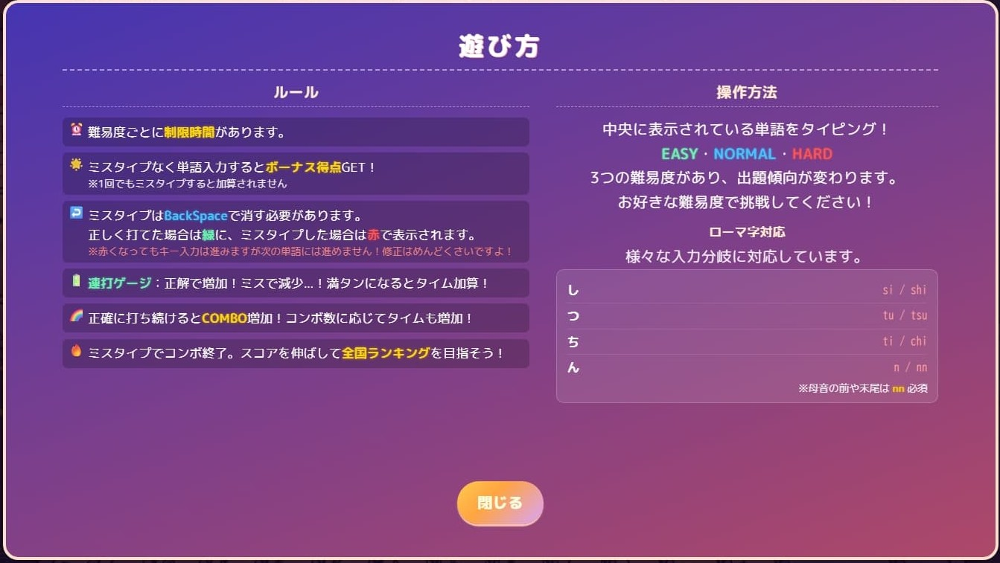
    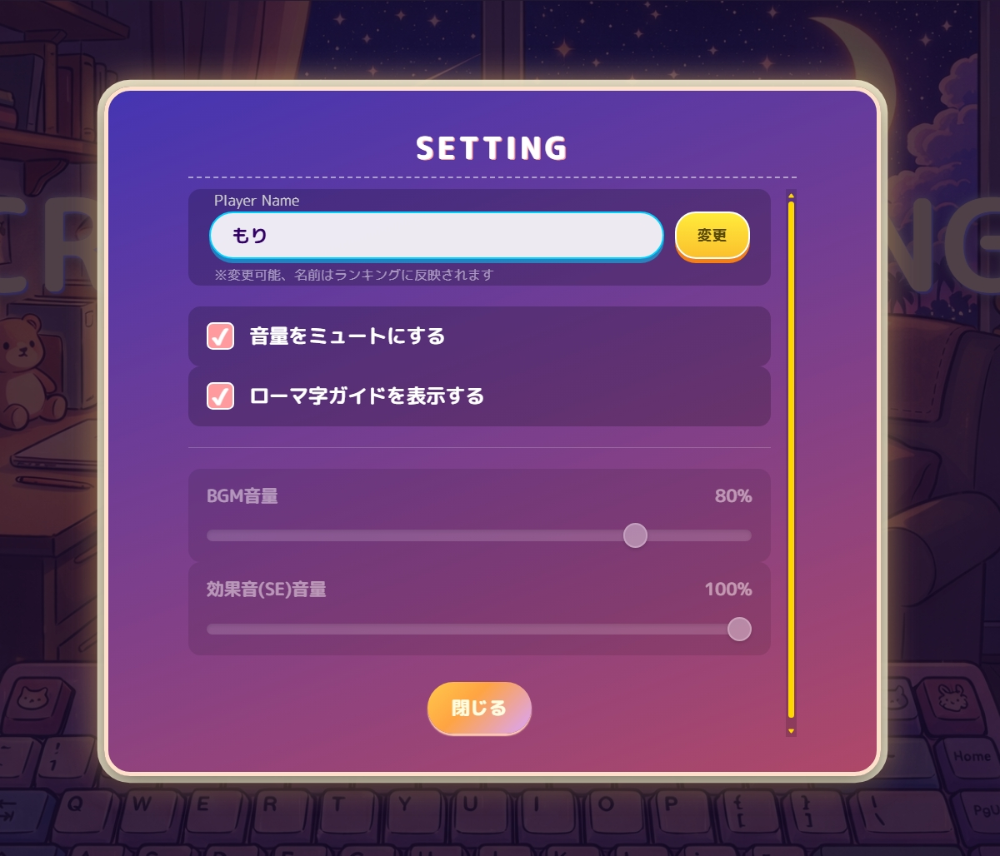

#### ・ 難易度選択、ハイスコア時のリザルト詳細

    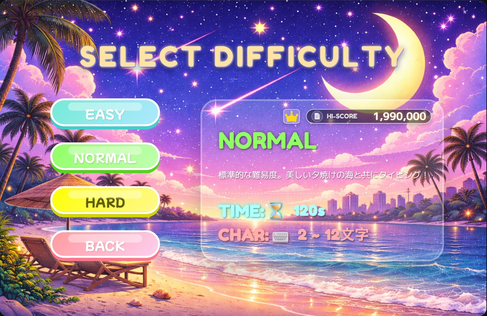
    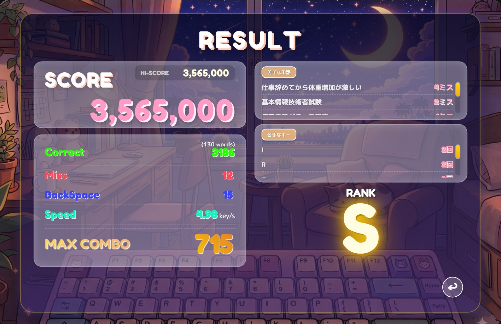

#### ・ ランキング画面詳細

    
    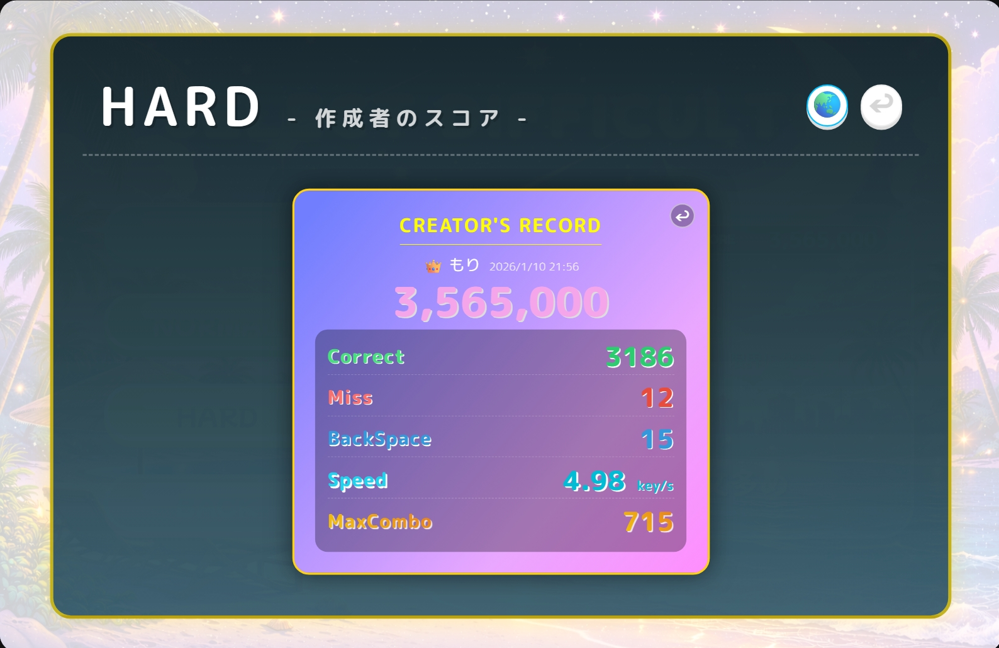

#### ・ ゲーム画面、リザルト画面

    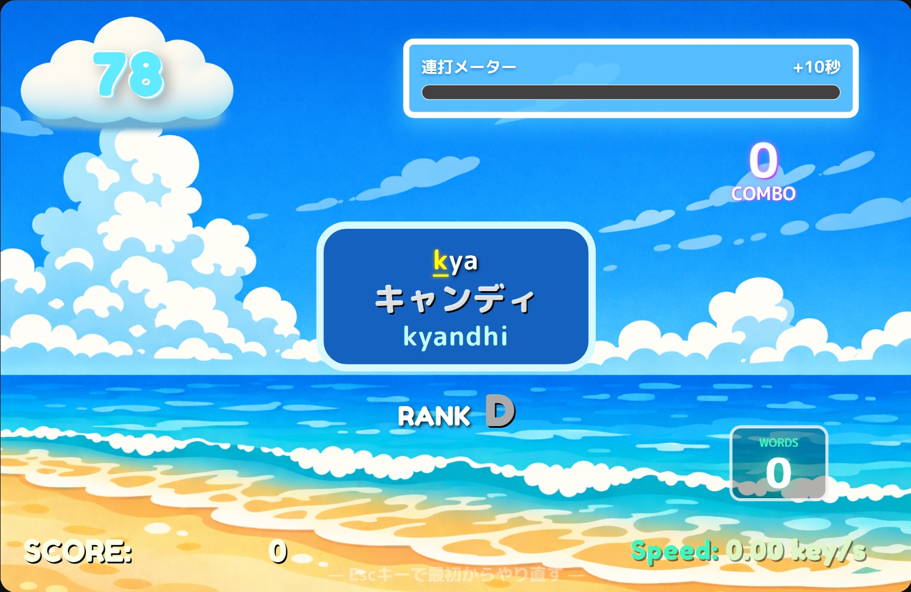
    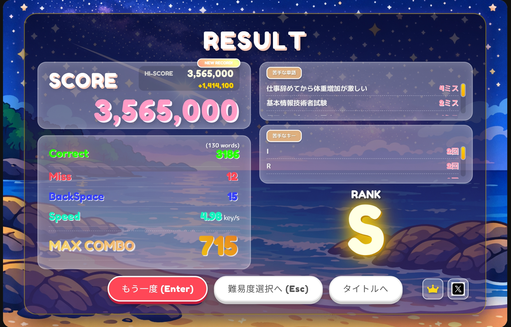

---

## 2. システム構成図（3 層アーキテクチャの採用）

本アプリケーションは、<b>「プレゼンテーション層（画面）」「アプリケーション層（認証・ロジック）」「データ層（DB）」</b>の 3 層アーキテクチャに基づき、セキュリティとパフォーマンスを両立するよう設計しました。

### ① プレゼンテーション層：ローカルストレージの活用

**（役割：UX の向上とサーバー負荷軽減）**

React（クライアントサイド）上でゲームロジックを完結させ、設定情報（音量など）はブラウザ固有の「ローカルストレージ」に保存しています。これにより、サーバー通信による<b>ラグ</b>をゼロにし、快適なプレイ環境を実現しました。

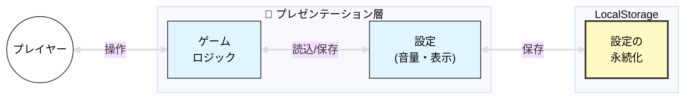
```mermaid
%%{init: {'theme': 'base', 'themeVariables': { 'fontSize': '13px', 'lineColor': '#dddddd'}, 'flowchart': {'nodeSpacing': 15, 'rankSpacing': 25}}}%%
graph LR
    User((プレイヤー))

    subgraph Presentation ["📱 プレゼンテーション層"]
        Logic["ゲーム<br/>ロジック"]
        State["設定<br/>(音量・表示)"]
    end

    subgraph Local ["LocalStorage"]
        Store["設定の<br/>永続化"]
    end

    User <---->|操作| Logic
    Logic <---->|読込/保存| State
    State <---->|保存| Store

    %% --- スタイル定義 ---
    %% ユーザー
    style User fill:#ffffff,stroke:#333,color:black

    %% ロジック・設定（水色系：処理）
    style Logic fill:#e1f5fe,stroke:#333,color:black
    style State fill:#e1f5fe,stroke:#333,color:black

    %% ローカルストレージ（黄色系：保存）
    style Store fill:#fff9c4,stroke:#333,stroke-width:2px,color:black

    %% 矢印を薄いグレーにする設定
    linkStyle default stroke:#dddddd,stroke-width:2px
```

### ② アプリケーション層：RLS によるセキュリティ

**（役割：不正な書き込みを防ぐ「門番」）**

ランキング登録時には、Supabase の認証機能（Auth）と<b>RLS（行レベルセキュリティ）</b>が「アプリケーション層」として機能します。 データベースの前に「本人確認を行う門番」を配置することで、他人のなりすましやスコア改ざんなどの不正アクセスを遮断する設計です。

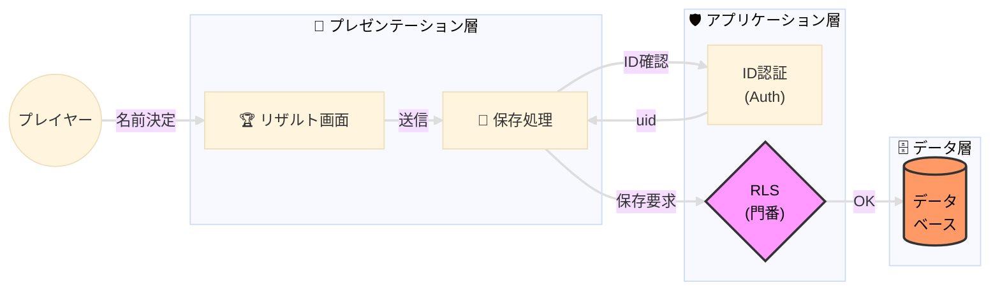
```mermaid
%%{init: {'theme': 'base', 'themeVariables': { 'fontSize': '13px', 'lineColor': '#dddddd'}, 'flowchart': {'nodeSpacing': 15, 'rankSpacing': 25}}}%%
graph LR
%% 矢印を「薄いグレー」に設定
    linkStyle default stroke:#dddddd,stroke-width:2px
    User((プレイヤー))

    subgraph Presentation ["📱 プレゼンテーション層"]
        Result["🏆 リザルト画面"]
        Logic["📡 保存処理"]
    end

    subgraph Application ["🛡️ アプリケーション層"]
        Auth["ID認証<br/>(Auth)"]
        RLS{"RLS<br/>(門番)"}
    end

    subgraph Data ["🗄️ データ層"]
        DB[("データ<br/>ベース")]
    end

    User -- "名前決定" --> Result
    Result -- "送信" --> Logic

    Logic -- "ID確認" --> Auth
    Auth -- "uid" --> Logic

    Logic -- "保存要求" --> RLS
    RLS -- "OK" --> DB

    %% スタイル定義
    style RLS fill:#f9f,stroke:#333,stroke-width:2px,color:black
    style DB fill:#f96,stroke:#333,stroke-width:2px,color:black

    %% 矢印を薄いグレーにする設定
    linkStyle default stroke:#dddddd,stroke-width:2px
```

### ③ データ層：クエリによる通信最適化

**（役割：必要なデータだけを提供）**

ランキング表示においては、データベース側で<b>ソート（並べ替え）とリミット（上位抽出）</b>のクエリ処理を行ってからフロントエンドに返却します。 全データをダウンロードするのではなく、サーバー側で計算を済ませることで、<b>通信量を最小限に抑え、スマホ回線でも高速に表示されるよう配慮しました。</b>

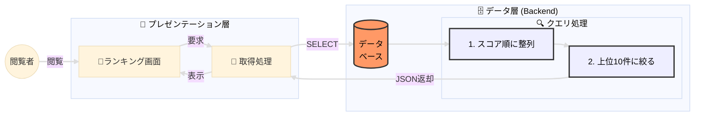
```mermaid
%%{init: {'theme': 'base', 'themeVariables': { 'fontSize': '13px'}, 'flowchart': {'nodeSpacing': 15, 'rankSpacing': 25}}}%%
graph LR
%% 矢印を「薄いグレー」に設定
    linkStyle default stroke:#dddddd,stroke-width:2px
    User((閲覧者))

    subgraph Presentation ["📱 プレゼンテーション層"]
        RankUI["👑ランキング画面"]
        Logic["📡 取得処理"]
    end

    subgraph Data ["🗄️ データ層 (Backend)"]
        direction TB
        DB[("データ<br/>ベース")]

        subgraph Process ["🔍 クエリ処理"]
            direction TB
            Sort["1. スコア順に整列"]
            Limit["2. 上位10件に絞る"]
        end
    end

    User -- "閲覧" --> RankUI
    RankUI -- "要求" --> Logic

    Logic -- "SELECT" --> DB
    DB --> Sort
    Sort --> Limit
    Limit -- "JSON返却" --> Logic
    Logic -- "表示" --> RankUI

    style DB fill:#f96,stroke:#333,stroke-width:2px,color:black
    style Sort fill:#eef,stroke:#333,stroke-width:2px,color:black
    style Limit fill:#eef,stroke:#333,stroke-width:2px,color:black
```

## 3. 詳細フローチャート図

- 手書きの設計書のフローチャートをデジタル化しました。
- 全体の流れと、主にこだわった入力処理と Backspace 処理を掲載します。
- 手書きの設計書も次項で貼りますのでよろしければご覧ください。

### ・ゲーム全体のフローチャート図

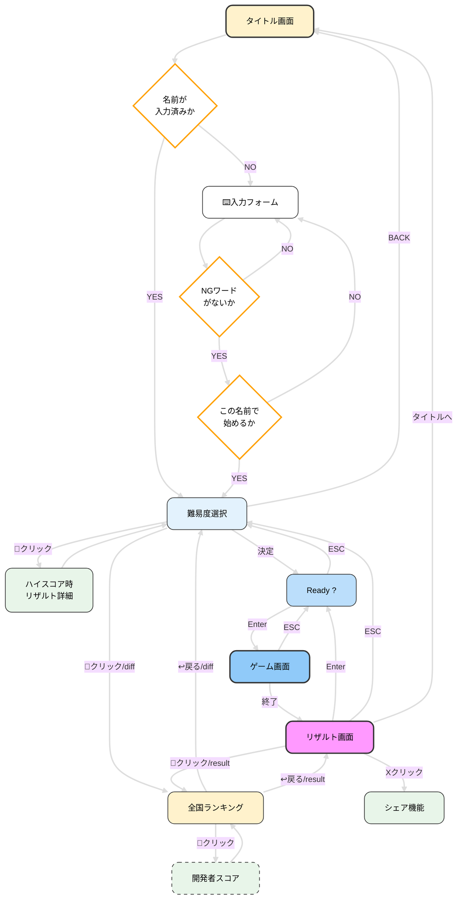
```mermaid
%%{init: {'theme': 'base', 'themeVariables': { 'fontSize': '12px'}, 'flowchart': {'nodeSpacing': 30, 'rankSpacing': 40}}}%%
flowchart TD
%% 矢印を「薄いグレー」に設定
    linkStyle default stroke:#dddddd,stroke-width:2px

    %% --- ノード定義 ---
    Title[タイトル画面]

    %% 横長ひし形のためのスペース調整（brタグを修正）
    CheckName{　　名前が<br/>入力済みか　　}

    Input[⌨️入力フォーム]
    CheckNG{　　NGワード<br/>がないか　　}
    Confirm{　　この名前で<br/>始めるか　　}

    DiffSelect[難易度選択]

    %% サブ画面グループ
    HighScore[ハイスコア時<br/>リザルト詳細]
    Ranking[全国ランキング]
    DevScore[開発者スコア]
    Share[シェア機能]

    %% ゲーム進行グループ
    Ready[Ready ?]
    Game[ゲーム画面]
    Result[リザルト画面]

    %% --- 接続フロー ---

    %% 1. スタート & 名前チェック
    Title --> CheckName
    CheckName -- YES --> DiffSelect
    CheckName -- NO --> Input

    %% 2. 名前入力ループ
    Input --> CheckNG
    CheckNG -- NO --> Input
    CheckNG -- YES --> Confirm

    Confirm -- NO --> Input
    Confirm -- YES --> DiffSelect

    %% 3. 難易度選択ハブ
    DiffSelect -- "決定" --> Ready
    DiffSelect -- "BACK" --> Title

    %% 脇道（難易度選択から）
    DiffSelect -- "📄クリック" --> HighScore
    HighScore --> DiffSelect
    DiffSelect -- "👑クリック/diff" --> Ranking
    %% 難易度選択へ戻るルート
    Ranking -- "↩️戻る/diff" --> DiffSelect

    %% 開発者スコア
    Ranking -- "👑クリック" --> DevScore
    DevScore --> Ranking

    %% 4. ゲームプレイ
    Ready -- "Enter" --> Game
    Ready -- "ESC" --> DiffSelect

    Game -- "終了" --> Result
    Game -- "ESC" --> Ready

    %% 5. リザルトからの分岐
    Result -- "Enter" --> Ready
    Result -- "ESC" --> DiffSelect
    Result -- "Xクリック" --> Share

    %% リザルトからランキングへの往復
    Result -- "👑クリック/result" --> Ranking
    Ranking -- "↩️戻る/result" --> Result

    %% リザルトからタイトルへの戻り
    Result -- "タイトルへ" --> Title

    %% --- スタイル定義（すべてに ,rx:10,ry:10 を追加） ---
    style Title fill:#fff2cc,stroke:#333,stroke-width:2px,color:black,rx:10,ry:10
    style Result fill:#f9f,stroke:#333,stroke-width:2px,color:black,rx:10,ry:10

    %% ひし形にも適用（レンダラーによってはひし形の角丸は効きにくい場合がありますが記述は合っています）
    classDef condition fill:#fff,stroke:#ffa000,stroke-width:2px,color:black,rx:10,ry:10;
    class CheckName,CheckNG,Confirm condition;

    style Input fill:#ffffff,stroke:#333,color:black,rx:10,ry:10

    style DiffSelect fill:#e3f2fd,stroke:#333,color:black,rx:10,ry:10
    style Ready fill:#bbdefb,stroke:#333,color:black,rx:10,ry:10
    style Game fill:#90caf9,stroke:#333,stroke-width:2px,color:black,rx:10,ry:10

    style Ranking fill:#fff2cc,stroke:#333,color:black,rx:10,ry:10
    style HighScore fill:#e8f5e9,stroke:#333,color:black,rx:10,ry:10
    style DevScore fill:#e8f5e9,stroke:#333,stroke-dasharray: 5 5,color:black,rx:10,ry:10
    %% 最後のcolorの値が抜けていたので修正しました
    style Share fill:#e8f5e9,stroke:#333,color:black,rx:10,ry:10
```

### ・ 入力分岐処理

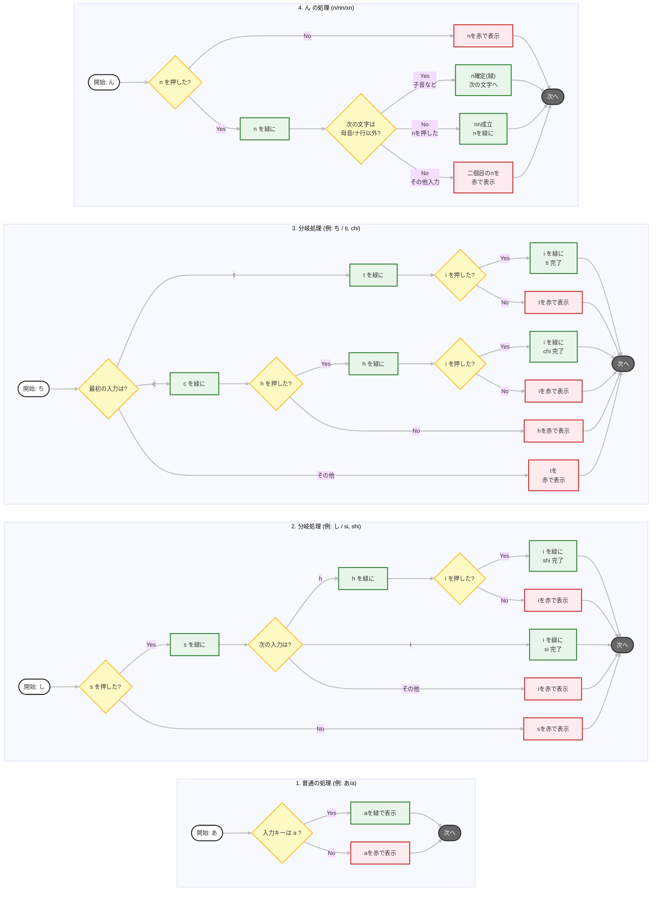
```mermaid
%%{init: {'theme': 'base', 'themeVariables': { 'fontSize': '13px', 'lineColor': '#cccccc'}, 'flowchart': {'nodeSpacing': 40, 'rankSpacing': 40}}}%%
graph LR
    %% 矢印を「薄いグレー」に設定
    linkStyle default stroke:#bbbbbb,stroke-width:2px,fill:none

    %% デザイン定義
    classDef default fill:#ffffff,stroke:#333,stroke-width:2px;

    %% === 【ここを変更しました】ひし形（判定）を黄色に変更 ===
    classDef decision fill:#fff9c4,stroke:#fbc02d,stroke-width:2px;

    %% 成功（緑）のスタイル定義
    classDef process fill:#e8f5e9,stroke:#2e7d32,stroke-width:2px;
    %% ミス（赤）のスタイル定義
    classDef error fill:#ffebee,stroke:#c62828,stroke-width:2px;
    %% 終了/次へのスタイル定義
    classDef endstate fill:#666,stroke:#333,stroke-width:2px,color:#fff;

    %% =====================================
    %% 1. 普通の処理 (あ / a)
    %% =====================================
    subgraph Basic_Input ["1. 普通の処理 (例: あ/a)"]
        direction LR
        Start_A([開始: あ]) --> Check_A{入力キーは a ?}
        class Check_A decision

        Check_A -- Yes --> Green_A[aを緑で表示]
        class Green_A process

        Check_A -- No --> Red_A[aを赤で表示]
        class Red_A error

        %% 成功も失敗もここへ合流
        Green_A --> Next_A([次へ])
        Red_A --> Next_A
        class Next_A endstate
    end

    %% =====================================
    %% 2. 分岐処理 (し / si, shi)
    %% =====================================
    subgraph Shi_Input ["2. 分岐処理 (例: し / si, shi)"]
        direction LR
        Start_Shi([開始: し]) --> Check_S{s を押した?}
        class Check_S decision

        Check_S -- Yes --> Green_S[s を緑に]
        class Green_S process

        %% ミスルート
        Check_S -- No --> Error_S[sを赤で表示]
        class Error_S error

        Green_S --> Wait_Shi_2{次の入力は?}
        class Wait_Shi_2 decision

        Wait_Shi_2 -- h --> Green_Sh[h を緑に]
        class Green_Sh process

        Wait_Shi_2 -- i --> Complete_Si["i を緑に<br>si 完了"]
        class Complete_Si process

        %% hの後の分岐
        Green_Sh --> Check_Shi_I{i を押した?}
        class Check_Shi_I decision

        Check_Shi_I -- Yes --> Complete_Shi["i を緑に<br>shi 完了"]
        class Complete_Shi process

        %% hの後のミス
        Check_Shi_I -- No --> Error_Shi_I[iを赤で表示]
        class Error_Shi_I error

        %% 2文字目のミス(その他)
        Wait_Shi_2 -- その他 --> Error_Shi[iを赤で表示]
        class Error_Shi error

        %% 全ルート合流地点
        Next_Shi([次へ])
        class Next_Shi endstate

        Complete_Si --> Next_Shi
        Complete_Shi --> Next_Shi
        Error_S --> Next_Shi
        Error_Shi_I --> Next_Shi
        Error_Shi --> Next_Shi
    end

    %% =====================================
    %% 3. 分岐処理 (ち / ti, chi)
    %% =====================================
    subgraph Chi_Input ["3. 分岐処理 (例: ち / ti, chi)"]
        direction LR
        Start_Chi([開始: ち]) --> Branch_Chi{最初の入力は?}
        class Branch_Chi decision

        %% ti ルート
        Branch_Chi -- t --> Green_T[t を緑に]
        class Green_T process
        Green_T --> Check_Ti_I{i を押した?}
        class Check_Ti_I decision

        Check_Ti_I -- Yes --> Complete_Ti["i を緑に<br>ti 完了"]
        class Complete_Ti process
        Check_Ti_I -- No --> Error_Ti[tを赤で表示]
        class Error_Ti error

        %% chi ルート
        Branch_Chi -- c --> Green_C[c を緑に]
        class Green_C process
        Green_C --> Check_Chi_H{h を押した?}
        class Check_Chi_H decision

        Check_Chi_H -- Yes --> Green_Ch[h を緑に]
        class Green_Ch process
        Check_Chi_H -- No --> Error_Chi[hを赤で表示]
        class Error_Chi error

        Green_Ch --> Check_Chi_I{i を押した?}
        class Check_Chi_I decision
        Check_Chi_I -- Yes --> Complete_Chi["i を緑に<br>chi 完了"]
        class Complete_Chi process
        Check_Chi_I -- No --> Error_Chi2[iを赤で表示]
        class Error_Chi2 error

        %% 最初の分岐ミス
        Branch_Chi -- その他 --> Error_Chi_Root[tを<br>赤で表示]
        class Error_Chi_Root error

        %% 全ルート合流地点
        Next_Chi([次へ])
        class Next_Chi endstate

        Complete_Ti --> Next_Chi
        Complete_Chi --> Next_Chi
        Error_Ti --> Next_Chi
        Error_Chi --> Next_Chi
        Error_Chi2 --> Next_Chi
        Error_Chi_Root --> Next_Chi
    end

    %% =====================================
    %% 4. 「ん」の処理 (n, nn, xn)
    %% =====================================
    subgraph N_Input ["4. ん の処理 (n/nn/xn)"]
        direction LR
        Start_N([開始: ん]) --> Check_N1{n を押した?}
        class Check_N1 decision

        %% 1文字目ミス
        Check_N1 -- No --> Error_N[nを赤で表示]
        class Error_N error

        Check_N1 -- Yes --> Green_N1[n を緑に]
        class Green_N1 process
        Green_N1 --> Check_Next{"次の文字は<br>母音/ナ行以外?"}
        class Check_Next decision

        Check_Next -- "Yes <br>子音など" --> Auto_N["n確定(緑)<br>次の文字へ"]
        class Auto_N process

        Check_Next -- "No <br>nを押した" --> Green_N2["nn成立<br>nを緑に"]
        class Green_N2 process

        %% 2文字目ミス
        Check_Next -- "No <br>その他入力" --> Error_N2[二個目のnを<br/>赤で表示]
        class Error_N2 error

        %% 全ルート合流地点
        Next_N([次へ])
        class Next_N endstate

        Green_N2 --> Next_N
        Auto_N --> Next_N
        Error_N --> Next_N
        Error_N2 --> Next_N
    end
```

---

### ・ Backspace 処理のフローチャート図

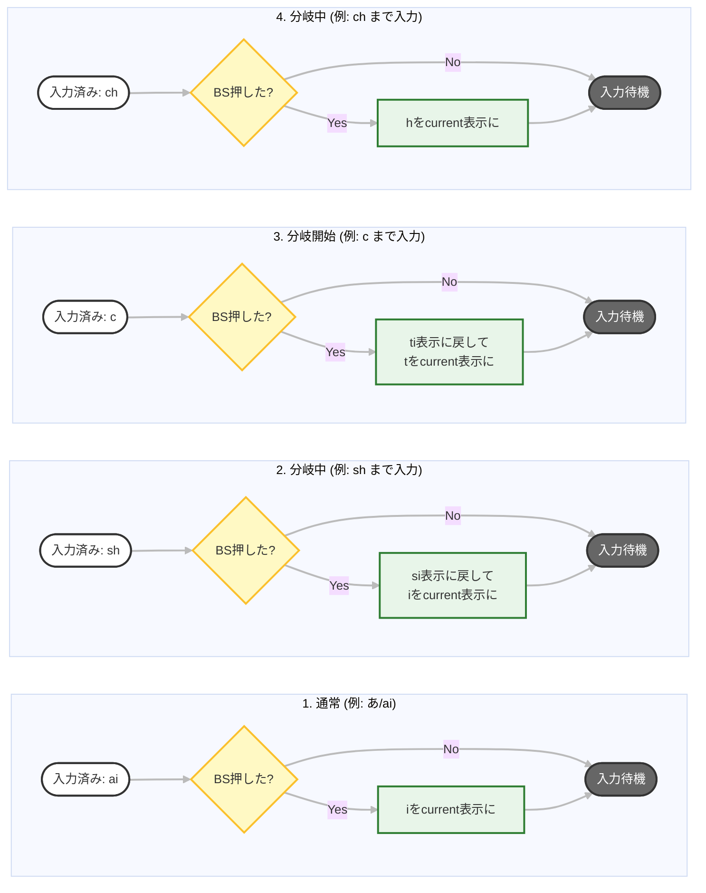
```mermaid
%%{init: {'theme': 'base', 'themeVariables': { 'fontSize': '13px', 'lineColor': '#cccccc'}, 'flowchart': {'nodeSpacing': 40, 'rankSpacing': 40}}}%%
graph LR
    %% 矢印を「薄いグレー」に設定
    linkStyle default stroke:#bbbbbb,stroke-width:2px,fill:none

    %% デザイン定義
    classDef default fill:#ffffff,stroke:#333,stroke-width:2px;
    classDef decision fill:#fff9c4,stroke:#fbc02d,stroke-width:2px;
    classDef process fill:#e8f5e9,stroke:#2e7d32,stroke-width:2px;
    classDef endstate fill:#666,stroke:#333,stroke-width:2px,color:#fff;

    %% =====================================
    %% 1. 通常 (あ/ai) の場合
    %% =====================================
    subgraph Normal_BS ["1. 通常 (例: あ/ai)"]
        direction LR
        State_Ai([入力済み: ai]) --> Check_BS_Ai{BS押した?}
        class Check_BS_Ai decision

        Check_BS_Ai -- Yes --> Delete_Ai[iをcurrent表示に]
        class Delete_Ai process

        Check_BS_Ai -- No --> Wait_Ai([入力待機])
        class Wait_Ai endstate

        Delete_Ai --> Wait_Ai
    end

    %% =====================================
    %% 2. 分岐: sh まで押した時
    %% =====================================
    subgraph Shi_BS ["2. 分岐中 (例: sh まで入力)"]
        direction LR
        State_Sh([入力済み: sh]) --> Check_BS_Sh{BS押した?}
        class Check_BS_Sh decision

        Check_BS_Sh -- Yes --> Delete_Sh_H["si表示に戻して<br/>iをcurrent表示に"]
        class Delete_Sh_H process

        Check_BS_Sh -- No --> Next_Sh([入力待機])
        class Next_Sh endstate

        Delete_Sh_H --> Next_Sh
    end

    %% =====================================
    %% 3. 分岐: ち の c を押した時
    %% =====================================
    subgraph Chi_C_BS ["3. 分岐開始 (例: c まで入力)"]
        direction LR
        State_C([入力済み: c]) --> Check_BS_C{BS押した?}
        class Check_BS_C decision

        Check_BS_C -- Yes --> Delete_C["ti表示に戻して</br>tをcurrent表示に"]
        class Delete_C process

        Check_BS_C -- No --> Next_C([入力待機])
        class Next_C endstate

        Delete_C --> Next_C
    end

    %% =====================================
    %% 4. 分岐: ち の ch を押した時
    %% =====================================
    subgraph Chi_CH_BS ["4. 分岐中 (例: ch まで入力)"]
        direction LR
        State_Ch([入力済み: ch]) --> Check_BS_Ch{BS押した?}
        class Check_BS_Ch decision

        Check_BS_Ch -- Yes --> Delete_Ch["hをcurrent表示に"]
        class Delete_Ch process

        Check_BS_Ch -- No --> Next_Ch([入力待機])
        class Next_Ch endstate

        Delete_Ch --> Next_Ch
    end
```

---

### ・ 単語処理のフローチャート

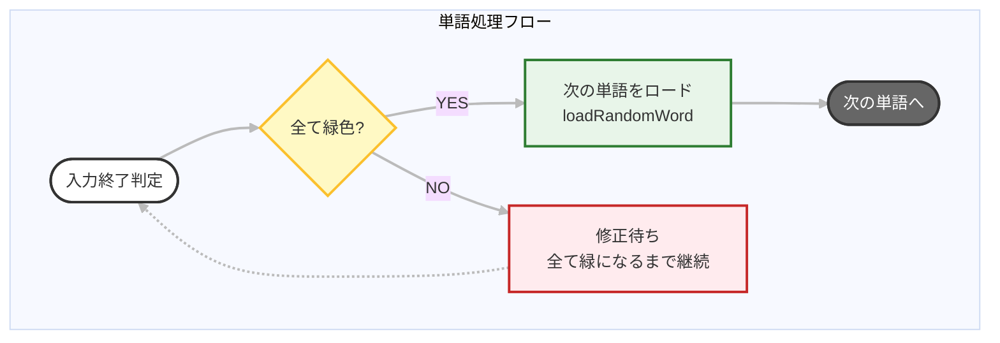
```mermaid
%%{init: {'theme': 'base', 'themeVariables': { 'fontSize': '13px', 'lineColor': '#cccccc'}, 'flowchart': {'nodeSpacing': 40, 'rankSpacing': 40}}}%%
graph LR
    %% 矢印を「薄いグレー」に設定
    linkStyle default stroke:#bbbbbb,stroke-width:2px,fill:none

    %% デザイン定義
    classDef default fill:#ffffff,stroke:#333,stroke-width:2px;
    classDef decision fill:#fff9c4,stroke:#fbc02d,stroke-width:2px;
    classDef process fill:#e8f5e9,stroke:#2e7d32,stroke-width:2px;
    classDef error fill:#ffebee,stroke:#c62828,stroke-width:2px;
    classDef endstate fill:#666,stroke:#333,stroke-width:2px,color:#fff;

    %% =====================================
    %% 単語処理フロー
    %% =====================================
    subgraph Word_Process ["単語処理フロー"]
        direction LR

        Start([入力終了判定]) --> Check_All_Green{全て緑色?}
        class Check_All_Green decision

        %% YESルート：次の単語へ
        Check_All_Green -- YES --> Load_Next[次の単語をロード<br>loadRandomWord]
        class Load_Next process

        Load_Next --> Next_Word([次の単語へ])
        class Next_Word endstate

        %% NOルート：修正待ち
        Check_All_Green -- NO --> Wait_Correction[修正待ち<br>全て緑になるまで継続]
        class Wait_Correction error

        %% 修正待ちはループ的な意味合いなので、入力待機へ戻す線
        Wait_Correction -.-> Start
    end
```

---

## 4. ER 図

- 管理人スコアと一般ユーザーは同じ構造のテーブルになるため、あえて一つのテーブルで管理し、is_creator カラムの Boolean 値が false を一般ユーザーとして扱い、一般ユーザーを全国ランキングに、管理人は is_creator カラムの Boolean 値を true にして開発者スコアに分断し、効率的なデータ管理を実現しています。

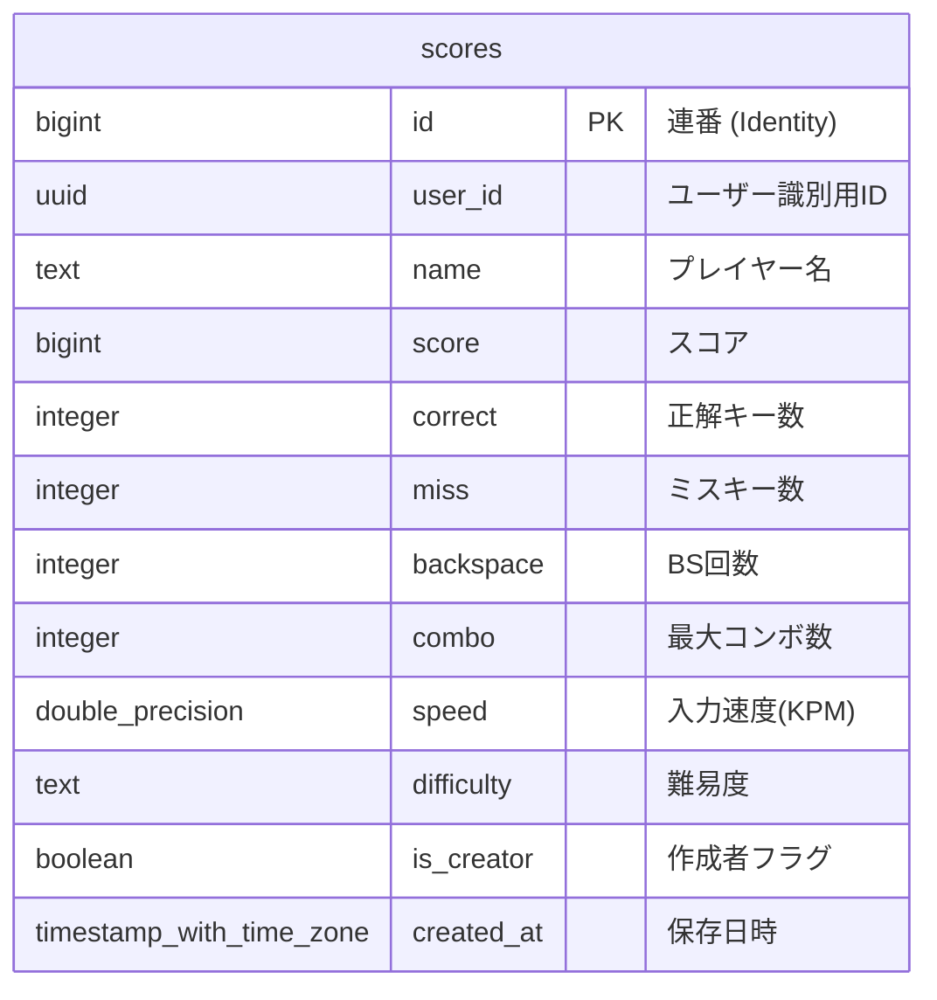
```mermaid
erDiagram
    %% キャプチャ画面の型と制約を完全に反映
    scores {
        bigint id PK "連番 (Identity)"
        uuid user_id "ユーザー識別用ID"
        text name "プレイヤー名"
        bigint score "スコア"
        integer correct "正解キー数"
        integer miss "ミスキー数"
        integer backspace "BS回数"
        integer combo "最大コンボ数"
        double_precision speed "入力速度(KPM)"
        text difficulty "難易度"
        boolean is_creator "作成者フラグ"
        timestamp_with_time_zone created_at "保存日時"
    }
```

## 5. 技術選定

### フロントエンド / インフラ

| カテゴリ             | 技術                  | 選定理由                                                                                                   |
| :------------------- | :-------------------- | :--------------------------------------------------------------------------------------------------------- |
| **Framework**        | **React**             | 生の JavaScript と比較し、保守性と拡張性を重視。コンポーネント化による状態管理のしやすさを評価。           |
| **Language**         | **TypeScript**        | 開発段階での型定義によりバグを削減し、品質や安全性、長期的な機能拡張においても堅牢なコードを維持するため。 |
| **Build Tool**       | **Vite**              | HMR（Hot Module Replacement）による高速な開発サイクルと、Vitest との親和性を考慮。                         |
| **BaaS**             | **Supabase**          | PostgreSQL の学習経験を活かしたデータ管理。RLS によるセキュリティ担保と開発効率の両立。                    |
| **Hosting**          | **Vercel**            | Vite/React 環境との親和性が高く、高速なデプロイが可能なため。                                              |
| **Testing**          | **Vitest**            | 環境構築が容易で、機能追加時のロジック崩れ（デグレ）を防止し品質を担保するため。                           |
| **Linter/Formatter** | **ESLint / Prettier** | 自動整形ツールによるコード品質の一貫性を保つ目的。                                                         |

---

## 技術選定のポイント

### 1. 「Vanilla JS」から「React/TypeScript」への移行

プロジェクト初期は DOM 操作の基礎理解のため HTML/CSS/JavaScript で構築していましたが、DOM 操作が複雑化し、将来機能追加等を行うと管理が大変になるため、**保守性**と**拡張性**を意識して移行しました。

- **保守性:** アプリケーションの規模拡大を見据え、宣言的な UI 構築が可能な React を採用。
- **安全性:** TypeScript を導入することで、型定義により実行前にエラーを防げる。将来機能拡張していった際に、**品質、安全性が担保された堅牢なコード**になる。

### 2. Supabase による堅牢なデータ管理

ランキング機能などのデータ整合性を保つため、型定義が厳格な**PostgreSQL**を採用しています。

- **セキュリティ:** RLS（Row Level Security）を活用し、ユーザー本人以外のデータ操作を制限。
- **開発効率:** 信頼性の高いバックエンドツールを導入することで、UI/UX の開発に注力できる環境を整えました。
- **勉強目的** OSS-DB Sliver を取得していた為、実際にPostgreSQLを扱ってみたかった。

### 3. テストによる品質担保

- **テスト** ゲームにかかわるロジックを中心に Vitest でテストを実施。機能追加による既存のロジック崩壊を防ぎ、品質を担保している。

---

## 6. ゲームの機能一覧

### ⚙️ 設定 (Settings)

- **名前変更機能**
  - 任意のユーザー名に変更でき、「変更」ボタンを押すことで即時反映されます。
  - NG ワードはエラーで入力できないようにしています。
- **音量設定**
  - BGM と効果音のバランスをスライドバーで調整可能です。
  - チェックボックスによる一括ミュート機能も搭載しています。
- **ローマ字ガイド**
  - 画面上のローマ字補助表示を非表示に設定できます。

### 🌙 難易度選択画面

- **王冠アイコン**
  - 全国ランキング（TOP10）を確認できます。
- **📄 アイコン**
  - ハイスコア時のリザルト詳細（統計データ）を確認できます。

### 🏆 ランキング画面

- **視覚的な強調**
  - 自分がランクインしている場合、**YOU バッジ**が付与され、色が変わることで一目で分かるようにしました。
- **開発者への挑戦**
  - ランキング画面の 👑 アイコンをクリックすると、開発者の参考スコアを確認できます。（目標の指標となり、開発者とも競える遊び心を実装）

### 🏁 Ready? 画面

- **アラート表示**
  - キーボード入力が必要なことを赤文字の点滅で警告表示します。
- **ショートカット操作**
  - **Enter** でゲーム開始、**Esc** で難易度選択画面に戻るクイック操作に対応しました。

### 🎮 ゲーム画面

- **入力分岐**
  - 様々なローマ字入力パターンに対応しています。（例：si / shi など）
- **Backspace**
  - 文字を消して戻すことができます。
  - 間違えた文字を放置して入力すると、**次の単語に進まないだけでなく、正解した文字まで消えて修正しないといけない仕様**です。
  - **手戻り入力による効率悪化**を再現することで、正確なタイピングを意識づける設計にしています。
- **お題の単語処理**
  - 正解は緑、間違いは赤で表示され、どちらでも次に進めます。
  - すべてのキーが緑（正解）になった瞬間に、次の単語がランダムで選出されます。
  - 同じ単語が連続で出現しないよう制御しています。（例：りんご → りんご の回避）
- **連打ゲージ**
  - 正確にキーを打つごとにゲージが蓄積され、MAX まで貯まるとタイムボーナスが加算されます。
  - ミスタイプをするとゲージが大きく減少します。
- **コンボシステム**
  - 正確にキーを打ち続けることでコンボ数が増加します。
  - 継続することで得られるスコアやタイムボーナスが増え、**爽快感**を味わえますが、**一度でもミスをすると 0 に戻る**緊張感のある仕様です。
- **スコア制**
  - スコアが表示されます。
  - コンボでスコアの倍率が変わります。
  - ミスなく単語を入力すると、PERFECT 演出が出て**文字列ボーナス**が加算されます。
- **RANK**
  - 現在のランクが表示され、スコアの値によって変わります。
- **WORDS**
  - クリアした単語数が表示されます。(同じ単語も加算されます。)
- **KeySpeed**
  - 現在のキー速度が表示されます。
  - **Miss**と**BackSpace**は含まれません。

## 📝 リザルト画面

- **演出**
  - スコア → 判定詳細 → 苦手単語、苦手キー詳細 → ランクの順に表示されます
  - **クリック**or**Enter**でランク表示までスキップ可能です。
- **スコア**
  - 終了時のスコアが表示され、ハイスコア時に**NEW RECORD バッジ**が付与されます。
  - ハイスコアとの差分表示が見れるようになってます。
- **判定詳細**
  - Correct: 正確キー数
  - Miss: ミスタイプ数
  - BackSpace: バックスペース数
  - Speed: Correct のみの平均速度
  - MAX COMBO: 最大コンボ数
- **苦手な単語、苦手なキー**
  - 間違えた単語とローマ字を多い順に 5 つ表示
  - **改善のための指標**に出来るよう導入
- **RANK**
  - 最終スコアの値によってランクを表示
  - ランクごとに演出が異なります。

### 🔴 ボタンメニュー

- **もう一度**をクリックまたは**Enter**を押すと Ready?画面に移動します。
- **難易度選択**をクリックまたは**ESC**を押すと難易度選択画面に移動します。
- **タイトルへ**をクリックするとタイトル画面に移動します。
- **王冠アイコン**をクリックすると全国ランキングが確認できます。
- **X アイコン**をクリックすると今回の結果をポストすることが出来ます。

---

## 7.セキュリティ対策とクレジット

本プロジェクトにおけるセキュリティ対策の設計思想と、使用素材のクレジット表記です。

## 🛡️ セキュリティ対策 

個人開発のゲームアプリですが、Webアプリケーションとしてセキュリティを意識し、以下の対策を講じています。

### 1. RLS (Row Level Security) によるデータ保護
ローカルストレージ採用なので直接APIを叩かれるとどうしても防げない為、**「データベースの最前線で防ぐ」**設計にしています。

* **不正書き込み防止:** `auth.uid() = user_id` のポリシーを適用し、**本人のスコアのみ**挿入・更新可能に制限。
* **なりすまし防止:** Supabase AuthのUIDを「仮の身分証明書」として利用。
* **最小権限の原則:** 必要なカラム以外へのアクセス権限を遮断。
* **Bot対策:** チェック制約を使い、ありえないスコアや挙動を弾く設定に。(こちらは運用データを見ながら閾値を調整予定)

### 2. インジェクション攻撃対策
* **SQLインジェクション:** プレースホルダを利用するSupabaseクライアント経由で操作を行うため、SQL文の直接的な組み立てを排除。
* **XSS (クロスサイトスクリプティング):** Reactの標準機能によるエスケープ処理を活用し、スクリプトの埋め込みを防止。
* **OSコマンドインジェクション:** OSコマンドを実行するプログラムを書いていないが、シェルを起動してコマンドを実行する関数の使用は避ける。(exec()やpassthru()等)

### 3. サプライチェーンセキュリティ
* **依存関係の管理:** 不要なライブラリを導入せず、`npm audit` 等で定期的に脆弱性をチェック。
* **機密情報の管理:** 機密情報を直書きせず、APIキー等は `.env` ファイルで管理し、`.gitignore` でGitHubへの流出を防止。

---

## 👏 クレジット (Special Thanks)

本ゲームの制作にあたり、以下の素晴らしい素材を使用させていただきました。心より感謝申し上げます。

### 🎵 BGM
* **しろう** 様
* **kyatto** 様

### 🔊 SE (効果音)
* **効果音ラボ** 様
* **魔王魂** 様
* **Springin'** 様

### 📚 参考・学習リソース
* 様々なタイピングゲームや音楽ゲームのシステムを参考にさせていただきました。

---

## 8. 開発プロセスと設計資料

- 開発前の設計図と開発後の設計図の手書きの設計書です。よろしければご覧ください。
- 開発後の設計書？とはなりますが、改めて書き直すことで設計書の重要性を自分なりに理解することが出来たので書いてよかったです。

<strong>📖 手書きの設計ノートを見る（クリックで展開）</strong>

#### ▼ 1. 開発する前に書いた初期の設計図

 

#### ▼ 2. ⇣【開発後に書いた設計図一部抜粋】シンプルなフローチャート

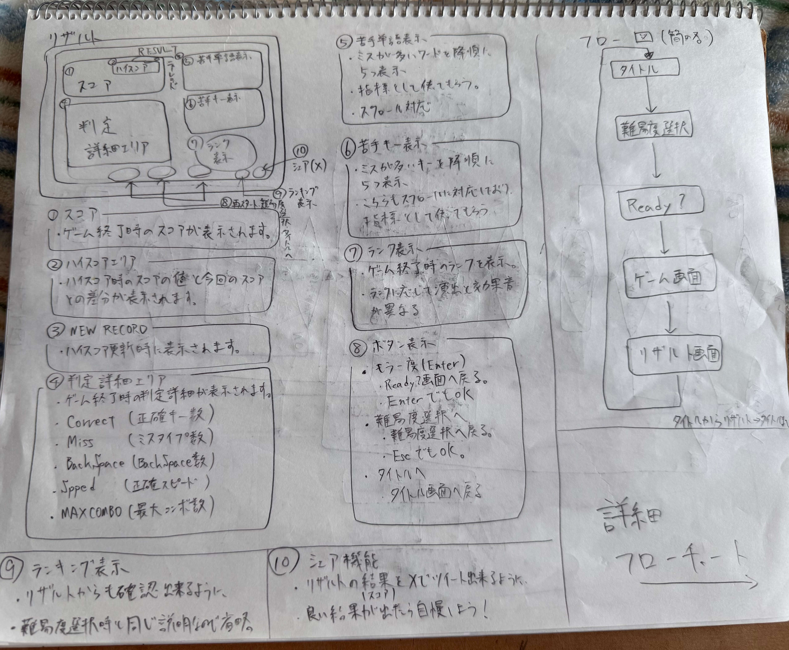

 

#### ▼ 3. 画面遷移と入力分岐等の詳細フローチャート

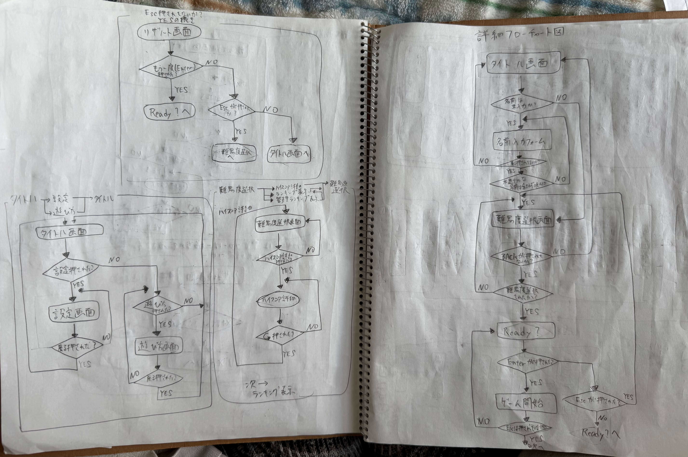

#### ▼ 4. BackSpace 処理のフローチャート、データベース設計と機能要件(BackEnd 構成も)

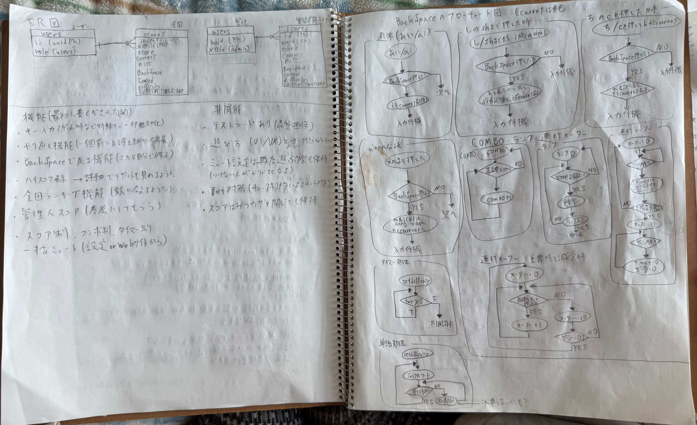

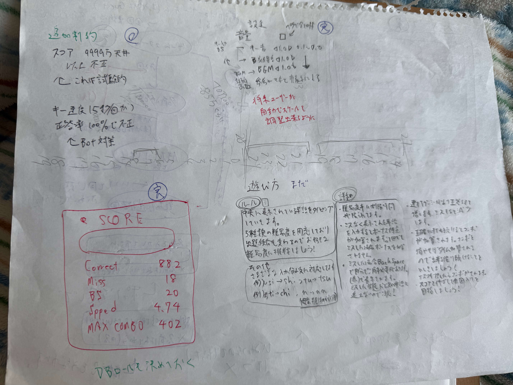

 

#### ▼ 5. セキュリティ構成

