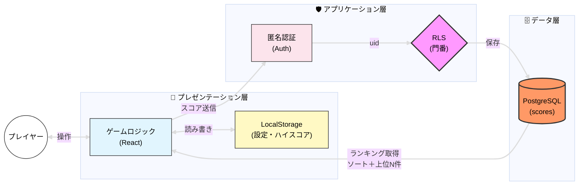
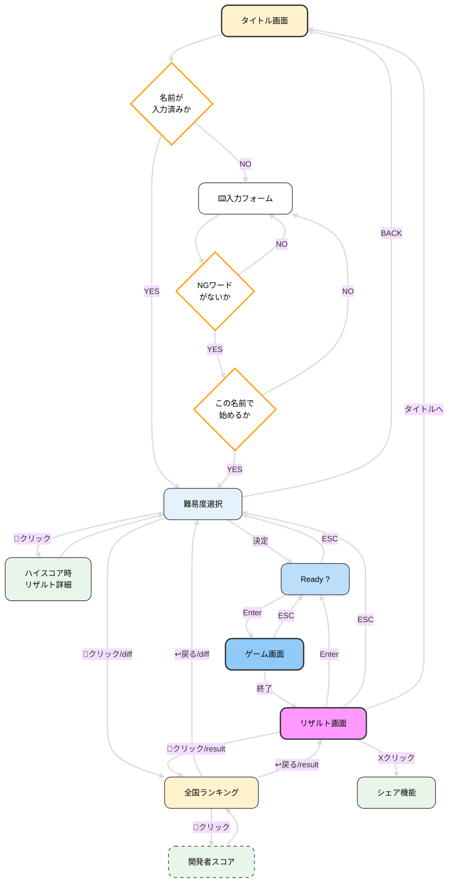
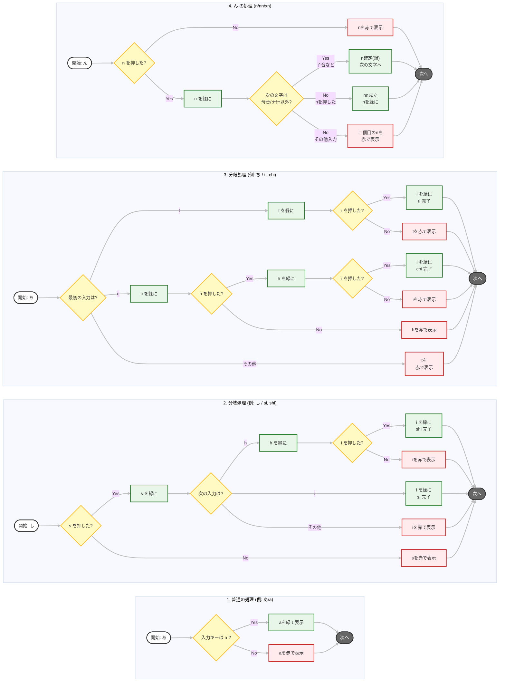
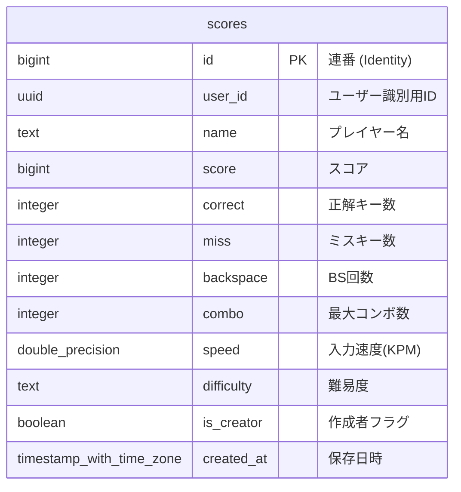

# --- CRITICAL_TYPING 開発ドキュメント ---

## 1. システム構成図

本アプリケーションは **「プレゼンテーション層・アプリケーション層・データ層」の 3 層アーキテクチャ** に基づき、セキュリティとパフォーマンスを両立するよう設計しました。

---

## 2. 詳細フローチャート図

- 手書きの設計書のフローチャートをデジタル化しました。
- 全体の流れと、主にこだわった入力処理と Backspace 処理を掲載します。
- 手書きの設計書も次項で貼りますのでよろしければご覧ください。

### ・ゲーム全体のフローチャート図

### ・ 入力分岐処理

---

### ・ Backspace 処理のフローチャート図

---

### ・ 単語処理のフローチャート

---

## 3. ER 図

- 管理人スコアと一般ユーザーは同じ構造のテーブルになるため、あえて一つのテーブルで管理し、is_creator カラムの Boolean 値が false を一般ユーザーとして扱い、一般ユーザーを全国ランキングに、管理人は is_creator カラムの Boolean 値を true にして開発者スコアに分断し、効率的なデータ管理を実現しています。

## 4. 技術選定

### フロントエンド / インフラ

| カテゴリ             | 技術                  | 選定理由                                                                                                   |
| :------------------- | :-------------------- | :--------------------------------------------------------------------------------------------------------- |
| **Framework**        | **React**             | 生の JavaScript と比較し、保守性と拡張性を重視。コンポーネント化による状態管理のしやすさを評価。           |
| **Language**         | **TypeScript**        | 開発段階での型定義によりバグを削減し、品質や安全性、長期的な機能拡張においても堅牢なコードを維持するため。 |
| **Build Tool**       | **Vite**              | HMR（Hot Module Replacement）による高速な開発サイクルと、Vitest との親和性を考慮。                         |
| **BaaS**             | **Supabase**          | PostgreSQL の学習経験を活かしたデータ管理。RLS によるセキュリティ担保と開発効率の両立。                    |
| **Testing**          | **Vitest** / **TESTING LIBRARY**            | 環境構築が容易で、機能追加時のロジック崩れ（デグレ）を防止し品質を担保するため。                           |
| **Monitorring**      | **Sentry** | 実行時のエラーやパフォーマンスをリアルタイムで検知し、ユーザー環境での不具合を迅速に修正する為
| **Linter/Formatter** | **ESLint / Prettier** | 自動整形ツールによるコード品質の一貫性を保つ目的。                                                         |
| **Hosting**          | **Vercel**            | Vite/React 環境との親和性が高く、高速なデプロイが可能なため。                                              |
---

## 技術選定のポイント

### 1. 「Vanilla JS」から「React/TypeScript」への移行

プロジェクト初期は DOM 操作の基礎理解のため `HTML/CSS/JavaScript` で構築していましたが、DOM 操作が複雑化し、将来機能追加等を行うと管理が大変になるため、**保守性**と**拡張性**を意識して移行しました。

- **保守性:** 生の JS で構築していたが DOM 操作が複雑化し管理が限界になったため `React` へ移行。
  仮想 DOM による計算ステップが増えるトレードオフはあるが、**宣言的 UI とコンポーネント分割による保守性・拡張性を優先した。**

- **型安全性:** `TypeScript` の型チェックはコンパイル時のみで実行時には効かないが、
  開発段階でバグの大半を検出できる点と、将来の機能拡張時に**堅牢なコードを維持できる点**を評価して採用。

### 2. Supabase による堅牢なデータ管理

ランキング機能などのデータ整合性を保つため、型定義が厳格な**PostgreSQL**を採用しています。

- **セキュリティ:** `RLS（Row Level Security）`と`ストアドプロシージャ`、`制約`を活用し、ユーザー本人以外のデータ操作を制限。
- **開発効率:** 信頼性の高いバックエンドツールを導入することで、**UI/UX の開発に注力できる環境を整えました。**
- **勉強目的** `OSS-DB Silver` を取得していた為、実際にPostgreSQLを扱ってみたかったという目的もあります。

| 操作 | 保護方法 | 理由 |
|---|---|---|
| SELECT | RLS = 全公開 | ランキングは誰でも見える（意図的 |               
| INSERT/UPDATE/DELETE | `security definer` 関数 + `auth.uid()` + NOT NULL制約 |本人のみ、かつ有効なセッション必須 |                                       
| スコア改ざん | バリデーション | 不正値の弾き飛ばし |

**なぜ REST ではなく RPC（ストアドプロシージャ）を使うのか**

REST でハイスコード更新を実装する場合、「取得 → フロントで比較 → 更新」の流れになります。
この設計だと比較ロジックがフロントに露出するため、DevTools からスコアを改ざんして送り込まれるリスクがあります。

RPC（`security definer` 関数）を経由することでフロントから直接テーブルを操作させず、
**バリデーションとハイスコア比較をサーバー側で完結**させています。
ロジックをデータベース層に閉じ込めることで、フロントからの不正な操作を根本から防ぐ設計にしています。

**SELECT を全公開にしている理由**

INSERT / UPDATE / DELETE は `auth.uid()` で本人のみに制限していますが、SELECT は意図的に全公開としています。
認証を要求するとランキングが自分のデータしか見えなくなるため、公開データとして扱うトレードオフを選択しています。

**読み取り最適化設計**

スコアの集計・計算は `RPC` 側で完結させ、フロントは結果を受け取るだけの設計にしています。
書き込み時のコストは増えますが、読み取りを軽量に保つことで**通信量を削減し、スマホ環境でも高速に動作します。**

### 3. テストによる品質担保

現状はゲームロジックを中心に Vitest で単体テストを実施し、機能追加による既存ロジックの崩壊を防いでいます。

| テスト種別 | 現状 | 今後の方針 |
|---|---|---|
| 単体テスト | ✅ ゲームロジック中心に実施済み | カバレッジ拡充 |
| 結合テスト | ❌ 未実施 | コンポーネント間の連携検証 |
| E2E / システムテスト | ❌ 未実施 | デプロイ環境での実際の操作検証 |

---

## 5. セキュリティ対策

個人開発のゲームアプリですが、Webアプリケーションとしてセキュリティを意識し、以下の対策を講じています。

### 1. RLS (Row Level Security) によるデータ保護

ローカルストレージ採用なので直接APIを叩かれるとどうしても防げない為、**「データベースの最前線で防ぐ」**設計にしています。

- **不正書き込み防止:** `auth.uid() = user_id` のポリシーを適用し、**本人のスコアのみ**挿入・更新・削除可能に制限。
- **なりすまし防止:** Supabase AuthのUIDを「仮の身分証明書」として利用。
- **最小権限の原則:** 必要なカラム以外へのアクセス権限を遮断。
- **Bot対策:** チェック制約を使い、ありえないスコアや挙動を弾く設定に。(こちらは運用データを見ながら閾値を調整予定)

### 2. インジェクション攻撃対策

- **SQLインジェクション:** プレースホルダを利用するSupabaseクライアント経由で操作を行うため、SQL文の直接的な組み立てを排除。
- **XSS (クロスサイトスクリプティング):** Reactの標準機能によるエスケープ処理を活用し、スクリプトの埋め込みを防止。
- **OSコマンドインジェクション:** OSコマンドを実行するプログラムを書いていないが、シェルを起動してコマンドを実行する関数の使用は避ける。(exec()やpassthru()等)

### 3. HTTPセキュリティヘッダー（vercel.json）

`vercel.json` にレスポンスヘッダーを設定し、ブラウザレベルの攻撃に対策しています。

| ヘッダー | 設定値（概要） | 設定しないと起きること |
|---|---|---|
| **CSP** | 自ドメイン・Supabase・Sentryのみ許可 | XSSで注入されたスクリプトが自由に実行され、LocalStorageやセッション情報を盗まれる |
| **HSTS** | max-age=2年・preload | 初回HTTP接続をSSLストリッピングで中継される → 中間者攻撃 → Cookieを盗みセッションハイジャック。`preload` で初回から強制HTTPS |
| **X-Content-Type-Options** | nosniff | ブラウザがファイルの中身を独自解釈し、画像ファイルに埋め込まれたスクリプトをJSとして実行させられる（MIMEスニッフィング） |
| **X-Frame-Options** | DENY | 悪意あるサイトにiframeで埋め込まれ、見えないボタンをクリックさせられる（クリックジャッキング） |
| **Referrer-Policy** | strict-origin-when-cross-origin | 外部サイト遷移時にURLのパスが漏れる |
| **Permissions-Policy** | カメラ・マイク・位置情報を無効化 | スクリプト注入時にデバイスのセンサー類へのアクセスを許してしまう |

> **CORSについて**
> vercel.json にCORS設定はありません。Supabase APIのCORSはSupabaseダッシュボード側で管理しており、
> フロントはVercelから静的ファイルを配信するだけのため、Vercel側でのCORSヘッダーは不要な構成です。

### 4. サプライチェーンセキュリティ

- **依存関係の管理:** 不要なライブラリを導入せず、`npm audit` 等で定期的に脆弱性をチェック。
- **機密情報の管理:** 機密情報を直書きせず、APIキー等は `.env` ファイルで管理し、`.gitignore` でGitHubへの流出を防止。

---

## 6. 開発プロセスと設計資料

- 開発前の設計図と開発後の設計図の手書きの設計書です。よろしければご覧ください。
- 開発後の設計書？とはなりますが、改めて書き直すことで設計書の重要性を自分なりに理解することが出来たので書いてよかったです。

<strong>📖 手書きの設計ノートを見る（クリックで展開）</strong>

#### ▼ 1. 開発する前に書いた初期の設計図

 

#### ▼ 2. ⇣【開発後に書いた設計図一部抜粋】シンプルなフローチャート

 

#### ▼ 3. 画面遷移と入力分岐等の詳細フローチャート

#### ▼ 4. BackSpace 処理のフローチャート、データベース設計と機能要件(BackEnd 構成も)

 

#### ▼ 5. セキュリティ構成

## 7. コード説明