# --- CRITICAL_TYPING 開発ドキュメント ---

## 1. システム構成図

本アプリケーションは **「プレゼンテーション層・アプリケーション層・データ層」の 3 層アーキテクチャ** に基づき、セキュリティとパフォーマンスを両立するよう設計しました。

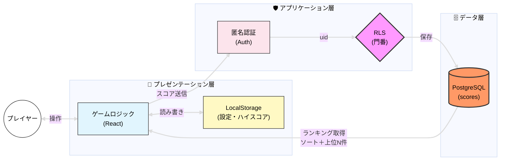

---

## 2. 詳細フローチャート図

- 手書きの設計書のフローチャートをデジタル化しました。
- 全体の流れと、主にこだわった入力処理と Backspace 処理を掲載します。
- 手書きの設計書も次項で貼りますのでよろしければご覧ください。

### ・ゲーム全体のフローチャート図

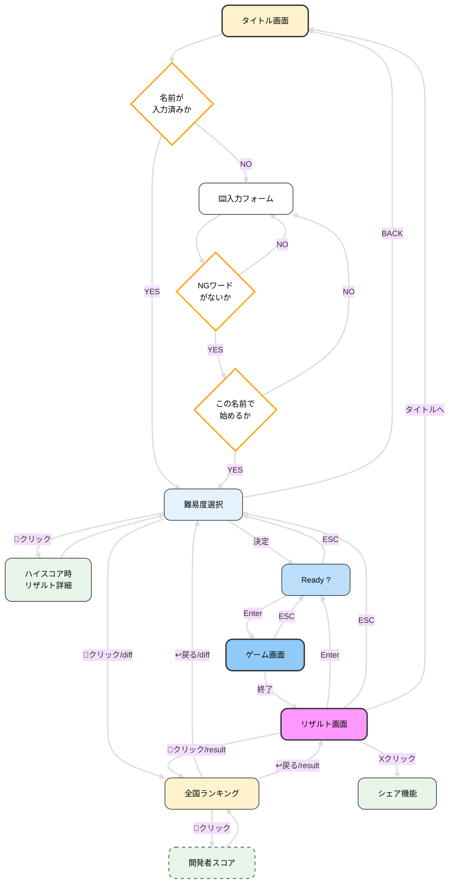

### ・ 入力分岐処理

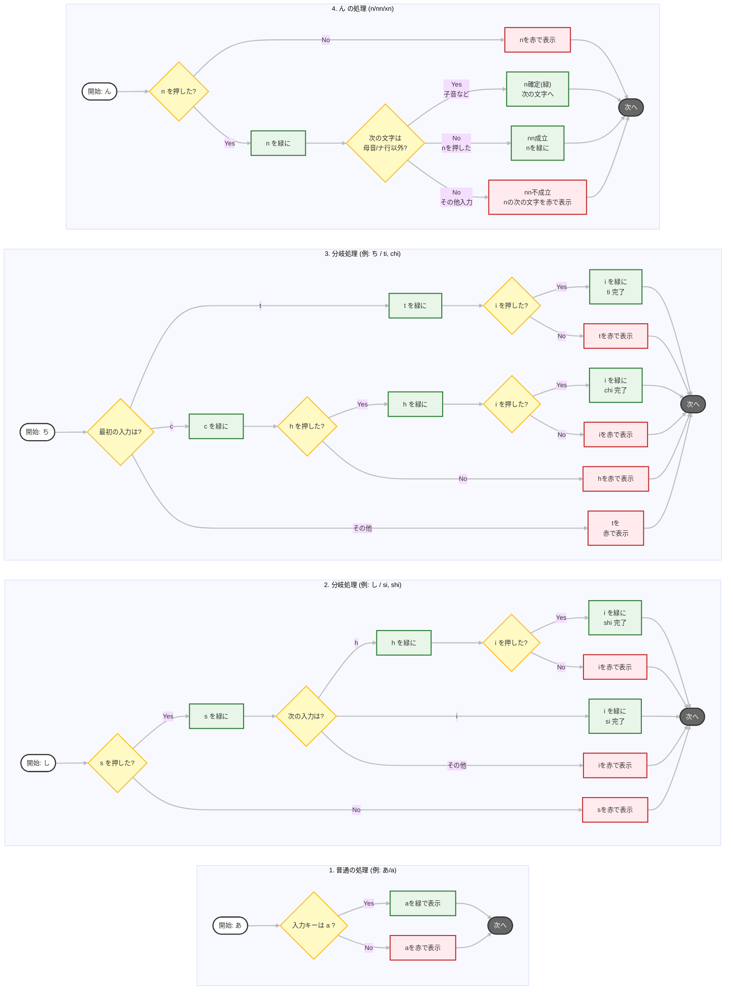

---

### ・ Backspace 処理のフローチャート図

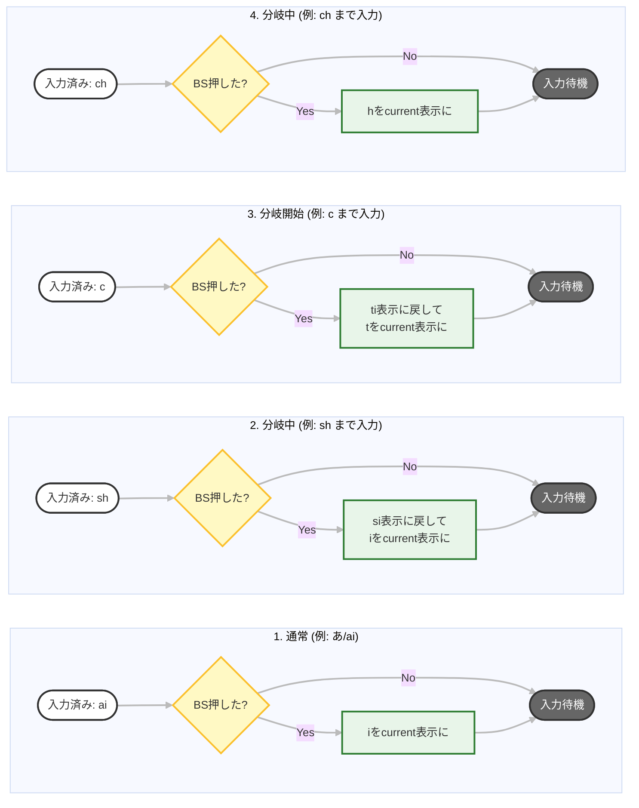

---

### ・ 単語処理のフローチャート

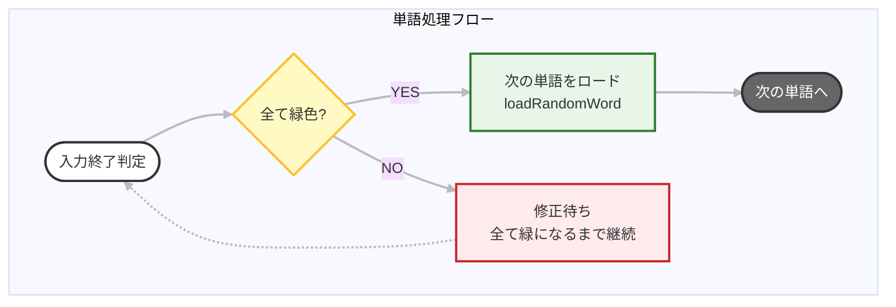

---

## 3. ER 図

- 管理人スコアと一般ユーザーは同じ構造のテーブルになるため、あえて一つのテーブルで管理し、is_creator カラムの Boolean 値が false を一般ユーザーとして扱い、一般ユーザーを全国ランキングに、管理人は is_creator カラムの Boolean 値を true にして開発者スコアに分断し、効率的なデータ管理を実現しています。

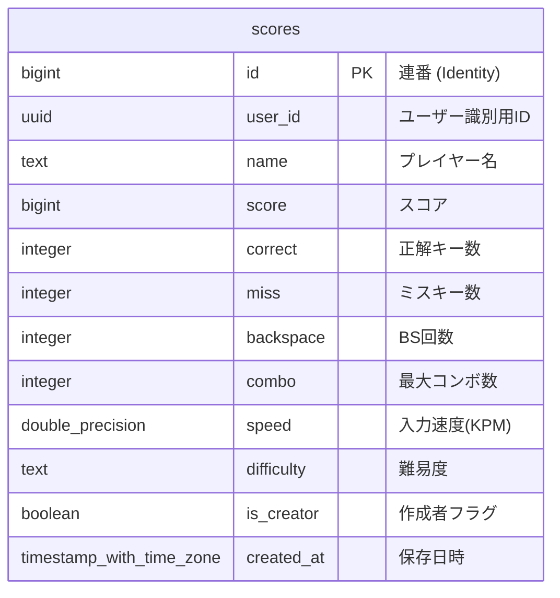

## 4. 技術選定

### フロントエンド / インフラ

| カテゴリ             | 技術                             | 選定理由                                                                                                   |
| :------------------- | :------------------------------- | :--------------------------------------------------------------------------------------------------------- |
| **Framework**        | **React**                        | 生の JavaScript と比較し、保守性と拡張性を重視。コンポーネント化による状態管理のしやすさを評価。           |
| **Language**         | **TypeScript**                   | 開発段階での型定義によりバグを削減し、品質や安全性、長期的な機能拡張においても堅牢なコードを維持するため。 |
| **Build Tool**       | **Vite**                         | HMR（Hot Module Replacement）による高速な開発サイクルと、Vitest との親和性を考慮。                         |
| **BaaS**             | **Supabase**                     | PostgreSQL の学習経験を活かしたデータ管理。RLS によるセキュリティ担保と開発効率の両立。                    |
| **Testing**          | **Vitest** / **TESTING LIBRARY** | 環境構築が容易で、機能追加時のロジック崩れ（デグレ）を防止し品質を担保するため。                           |
| **Monitorring**      | **Sentry**                       | 実行時のエラーやパフォーマンスをリアルタイムで検知し、ユーザー環境での不具合を迅速に修正する為             |
| **Linter/Formatter** | **ESLint / Prettier**            | 自動整形ツールによるコード品質の一貫性を保つ目的。                                                         |
| **Hosting**          | **Vercel**                       | Vite/React 環境との親和性が高く、高速なデプロイが可能なため。                                              |

---

## 技術選定のポイント

### 1. 「Vanilla JS」から「React/TypeScript」への移行

プロジェクト初期は DOM 操作の基礎理解のため `HTML/CSS/JavaScript` で構築していましたが、DOM 操作が複雑化し、将来機能追加等を行うと管理が大変になるため、**保守性**と**拡張性**を意識して移行しました。

- **保守性:** 生の JS で構築していたが DOM 操作が複雑化し管理が限界になったため `React` へ移行。
  変更差分を纏めて管理できる(差分計算のステップが増える)
  仮想 DOM による計算ステップが増えるトレードオフはあるが、**宣言的 UI とコンポーネント分割による保守性・拡張性を優先した。**

- **型安全性:** `TypeScript` の型チェックはコンパイル時のみで実行時には効かないが、
  開発段階でバグの大半を検出できる点と、将来の機能拡張時に**堅牢なコードを維持できる点**を評価して採用。

### 2. Supabase による堅牢なデータ管理

ランキング機能などのデータ整合性を保つため、型定義が厳格な**PostgreSQL**を採用しています。

- **セキュリティ:** `RLS（Row Level Security）`と`ストアドプロシージャ`、`制約`を活用し、ユーザー本人以外のデータ操作を制限。
- **開発効率:** 信頼性の高いバックエンドツールを導入することで、**UI/UX の開発に注力できる環境を整えました。**
- **勉強目的** `OSS-DB Silver` を取得していた為、実際にPostgreSQLを扱ってみたかったという目的もあります。

| 操作                 | 保護方法                                              | 理由                               |
| -------------------- | ----------------------------------------------------- | ---------------------------------- |
| SELECT               | RLS = 全公開                                          | ランキングは誰でも見える（意図的   |
| INSERT/UPDATE/DELETE | `security definer` 関数 + `auth.uid()` + NOT NULL制約 | 本人のみ、かつ有効なセッション必須 |
| スコア改ざん         | バリデーション                                        | 不正値の弾き飛ばし                 |

**なぜ REST ではなく RPC（ストアドプロシージャ）を使うのか**

REST でハイスコア更新を実装する場合、「取得 → フロントで比較 → 更新」の流れになります。
この設計だと比較ロジックがフロントに露出するため、DevTools からスコアを改ざんして送り込まれるリスクがあります。

RPC（`security definer` 関数）を経由することでフロントから直接テーブルを操作させず、
**バリデーションとハイスコア比較をサーバー側で完結**させています。
ロジックをデータベース層に閉じ込めることで、フロントからの不正な操作を根本から防ぐ設計にしています。

**SELECT を全公開にしている理由**

INSERT / UPDATE / DELETE は `auth.uid()` で本人のみに制限していますが、SELECT は意図的に全公開としています。
認証を要求するとランキングが自分のデータしか見えなくなるため、公開データとして扱うトレードオフを選択しています。

**読み取り最適化設計**

スコアの集計・計算は `RPC` 側で完結させ、フロントは結果を受け取るだけの設計にしています。
書き込み時のコストは増えますが、読み取りを軽量に保つことで**通信量を削減し、スマホ環境でも高速に動作します。**

### 3. テストによる品質担保

現状はゲームロジックを中心に Vitest で単体テストを実施し、機能追加による既存ロジックの崩壊を防いでいます。

| テスト種別           | 現状                            | 今後の方針                     |
| -------------------- | ------------------------------- | ------------------------------ |
| 単体テスト           | ✅ ゲームロジック中心に実施済み | カバレッジ拡充                 |
| 結合テスト           | ❌ 未実施                       | コンポーネント間の連携検証     |
| E2E / システムテスト | ❌ 未実施                       | デプロイ環境での実際の操作検証 |

---

## 5. セキュリティ対策

個人開発のゲームアプリですが、Webアプリケーションとしてセキュリティを意識し、以下の対策を講じています。

### 1. RLS (Row Level Security) によるデータ保護

ローカルストレージ採用なので直接APIを叩かれるとどうしても防げない為、 **「データベースの最前線で防ぐ」** 設計にしています。

- **不正書き込み防止:** `auth.uid() = user_id` のポリシーを適用し、**本人のスコアのみ**挿入・更新・削除可能に制限。
- **なりすまし防止:** Supabase AuthのUIDを「仮の身分証明書」として利用。
- **最小権限の原則:** 必要なカラム以外へのアクセス権限を遮断。
- **Bot対策:** チェック制約を使い、ありえないスコアや挙動を弾く設定に。(こちらは運用データを見ながら閾値を調整予定)

### 2. インジェクション攻撃対策

- **SQLインジェクション:** プレースホルダを利用するSupabaseクライアント経由で操作を行うため、SQL文の直接的な組み立てを排除。
- **XSS (クロスサイトスクリプティング):** Reactの標準機能によるエスケープ処理を活用し、スクリプトの埋め込みを防止。
- **OSコマンドインジェクション:** OSコマンドを実行するプログラムを書いていないが、シェルを起動してコマンドを実行する関数の使用は避ける。(exec()やpassthru()等)

### 3. HTTPセキュリティヘッダー（vercel.json）

`vercel.json` にレスポンスヘッダーを設定し、ブラウザレベルの攻撃に対策しています。

| ヘッダー                   | 設定値（概要）                                                           | 設定しないと起きること                                                                                                       |
| -------------------------- | ------------------------------------------------------------------------ | ---------------------------------------------------------------------------------------------------------------------------- |
| **CSP**                    | 自ドメイン・Supabase・Sentryのみ許可。`unsafe-inline` なしで動作確認済み | XSSで注入されたスクリプトが自由に実行され、LocalStorageやセッション情報を盗まれる                                            |
| **HSTS**                   | max-age=2年・preload                                                     | 初回HTTP接続をSSLストリッピングで中継される → 中間者攻撃 → Cookieを盗みセッションハイジャック。`preload` で初回から強制HTTPS |
| **X-Content-Type-Options** | nosniff                                                                  | ブラウザがファイルの中身を独自解釈し、画像ファイルに埋め込まれたスクリプトをJSとして実行させられる（MIMEスニッフィング）     |
| **X-Frame-Options**        | DENY                                                                     | 悪意あるサイトにiframeで埋め込まれ、見えないボタンをクリックさせられる（クリックジャッキング）                               |
| **Referrer-Policy**        | strict-origin-when-cross-origin                                          | 外部サイト遷移時にURLのパスが漏れる                                                                                          |
| **Permissions-Policy**     | カメラ・マイク・位置情報を無効化                                         | スクリプト注入時にデバイスのセンサー類へのアクセスを許してしまう                                                             |

> **CORSについて**
> vercel.json にCORS設定はありません。Supabase APIのCORSはSupabaseダッシュボード側で管理しており、
> フロントはVercelから静的ファイルを配信するだけのため、Vercel側でのCORSヘッダーは不要な構成です。

### 4. サプライチェーンセキュリティ

- **依存関係の管理:** 不要なライブラリを導入せず、`npm audit` 等で定期的に脆弱性をチェック。
- **機密情報の管理:** 機密情報を直書きせず、APIキー等は `.env` ファイルで管理し、`.gitignore` でGitHubへの流出を防止。

---

## 5. 開発プロセスと設計資料

- 開発前の設計図とデプロイ後(1/8地点)の手書きの設計書です。よろしければご覧ください。
- 開発後の設計書？とはなりますが、改めて書き直すことで設計書の重要性を自分なりに理解することが出来たので書いてよかったです。

<details>
<summary><strong>📖 手書きの設計ノートを見る（クリックで展開）</strong></summary>

#### ▼ 1. 開発する前に書いた初期の設計図

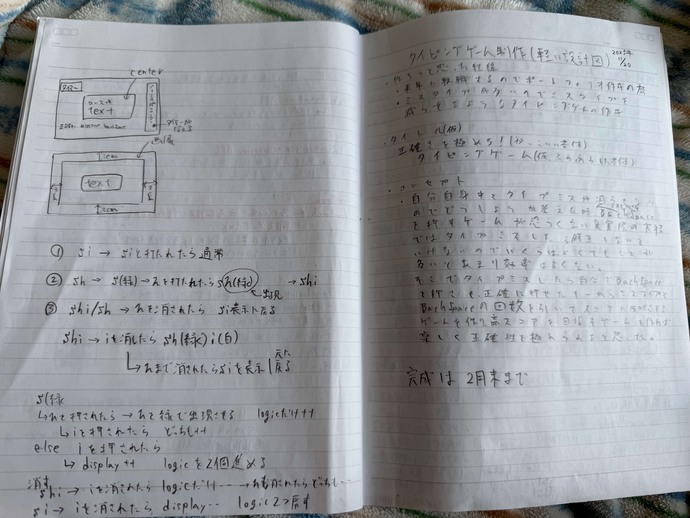
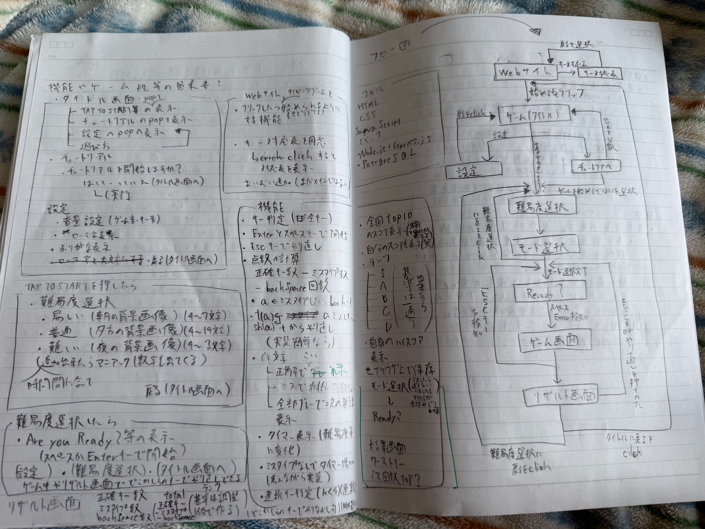

<br>

#### ▼ 2. ⇣【開発後に書いた設計図一部抜粋】シンプルなフローチャート

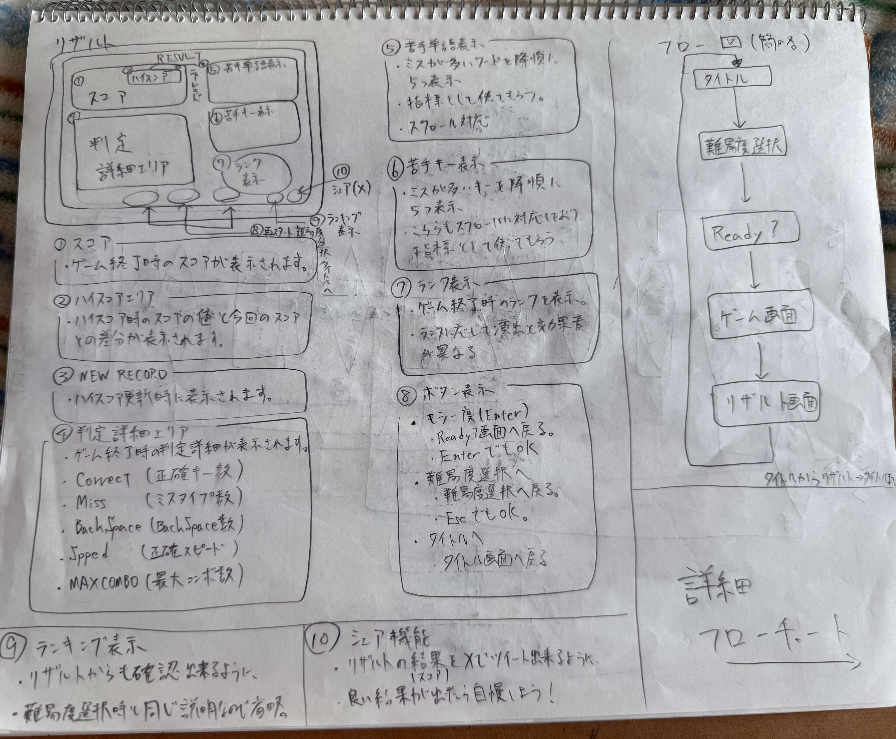

<br>

#### ▼ 3. 画面遷移と入力分岐等の詳細フローチャート

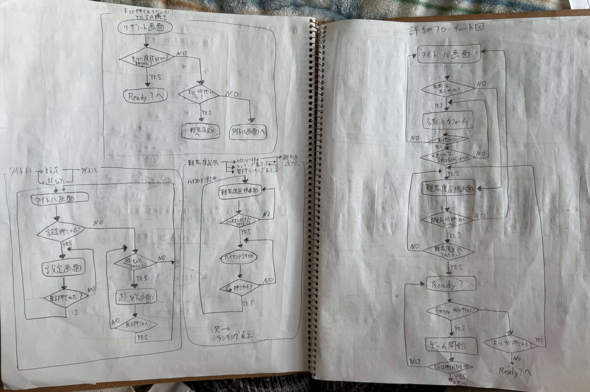

#### ▼ 4. BackSpace 処理のフローチャート、データベース設計と機能要件(BackEnd 構成も)

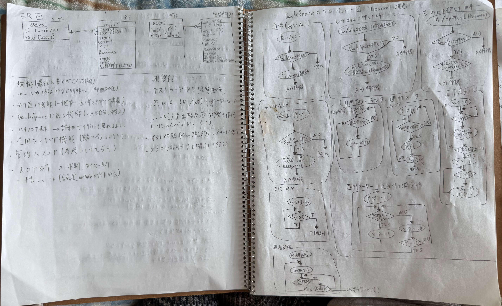
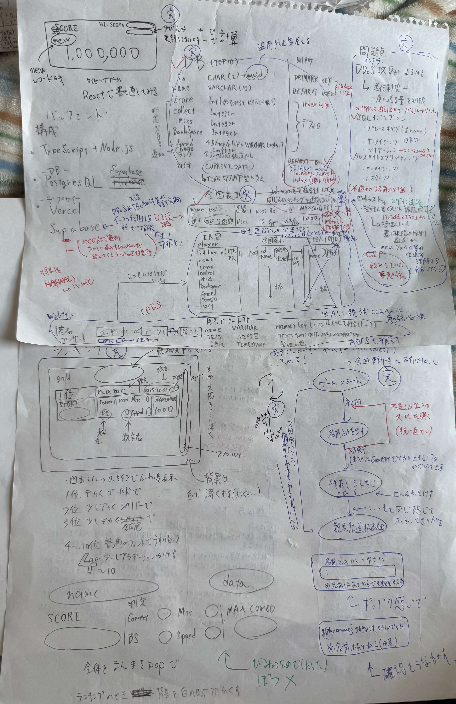
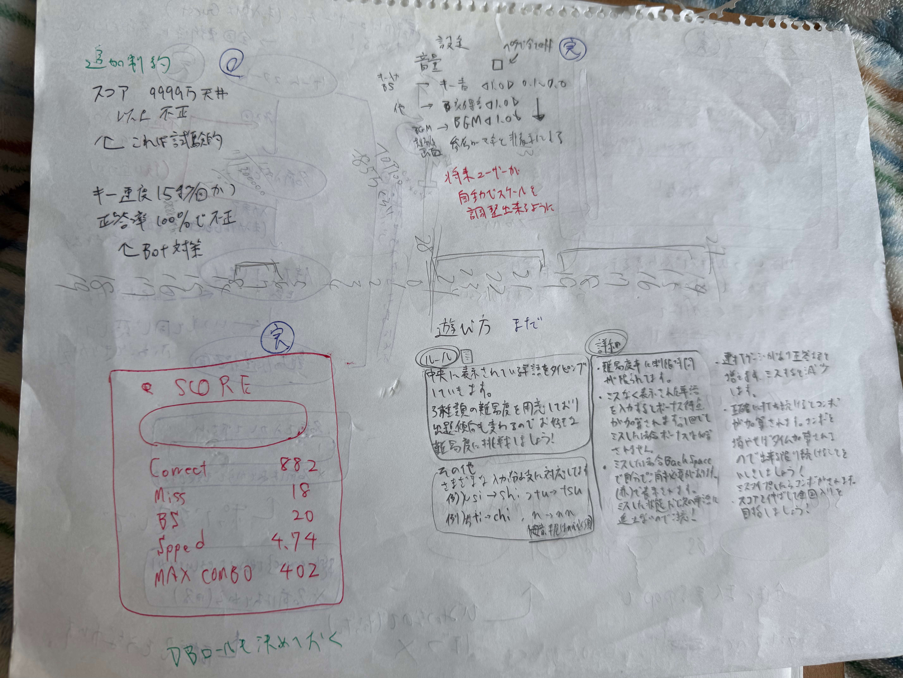

<br>

#### ▼ 5. セキュリティ構成

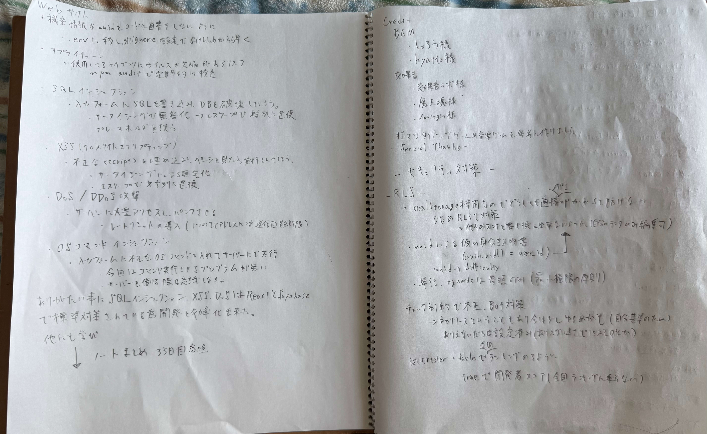

</details>

## 7. コード説明

### ① TypingEngine / Segment クラス（`useTypingEngine.ts`）

タイピング判定の核となるクラス。React の外側（クラス）に切り出した理由は、**キー入力のたびに状態を直接書き換える「ミュータブルな処理」** が必要なためです。

**なぜ `useState` ではダメなのか — 具体例**

速いタイピストが `s` → `h` を連打したケースで考えます。

```ts
// もし inputBuffer を useState で管理していた場合
const [inputBuffer, setInputBuffer] = useState("");

const handleKey = (key: string) => {
  const nextBuffer = inputBuffer + key; // inputBuffer は今のレンダリング時点の値
  if (patterns.some((p) => p.startsWith(nextBuffer))) {
    setInputBuffer(nextBuffer); // ← React に「次回から使って」と予約するだけ
  }
};
```

`setInputBuffer` は次の再レンダリングまで反映されません。
速い入力で `s` のハンドラが完了する前に `h` のハンドラが走ると、`h` が参照する `inputBuffer` は**まだ `""` のまま**です。
`nextBuffer = "" + "h" = "h"` はどのパターンにも一致しないため**ミス判定**になります。

クラスの `this.inputBuffer` は**同期的に書き換わる**ため、`s` の処理が終わった瞬間に `"s"` になっています。
次の `h` は `"s" + "h" = "sh"` で正しく分岐を追えます。

**ローマ字バリエーション辞書（`ROMA_VARIATIONS`）の構造**

```ts
// romajiMap.ts の一部
si:  ["si", "shi", "ci"],
shi: ["si", "shi", "ci"],  // ← si と shi は同じ patterns を持つ
```

`し` に対応するキーが `"si"` と `"shi"` の 2 つあり、どちらも同じ `patterns` 配列を持ちます。
`segmentize` 時に `"し"` のローマ字 `"shi"` を解析すると `SORTED_ROMA_KEYS` の長い順サーチで `"shi"` が `"si"` より先にヒットし、canonical が `"shi"` のセグメントが生成されます。しかしどちらのキーでセグメント化しても patterns は同じなので、`"si"` と `"shi"` 両方の入力ルートが保持されます。

ユーザーが最初に `s` を打った時点では、`patterns` の全候補（`"si"`, `"shi"`, `"ci"`）が `"s"` で始まるため、**どのルートも生きている**状態です。
`display` ゲッターは `patterns.find(p => p.startsWith(inputBuffer))` で最初に見つかった `"si"` をガイド表示しますが、`"shi"` ルートも消えていません。

**SORTED_ROMA_KEYS（静的ソート）**

```ts
const SORTED_ROMA_KEYS = Object.keys(ROMA_VARIATIONS).sort(
  (a, b) => b.length - a.length,
);
```

ローマ字テーブルのキーを「文字数の多い順」にソートした配列を、モジュール読み込み時に 1 回だけ生成しています。
ソートなしで `segmentize("shi...")` を処理すると、`"s"` が先にヒットして 1 文字のセグメントが作られてしまい、残りの `"h"` が正しく解析されません。
コンポーネント内に書くと再レンダリングのたびに計算が走るため、モジュールスコープに置いて使い回す設計にしています。

**バックスペースで `sh` → `si` 表示に戻る処理**

```ts
// Segment.backspace()
backspace(): boolean {
  if (this.inputBuffer.length > 0) {
    this.inputBuffer = this.inputBuffer.slice(0, -1); // "sh" → "s"
    this.typedLog.pop();
    return true;
  }
  return false;
}

// display ゲッター
get display() {
  if (this.inputBuffer === "") return this.patterns[0];
  const match = this.patterns.find((p) => p.startsWith(this.inputBuffer));
  return match ? match : this.patterns[0];
}
```

`"sh"` の状態でバックスペースを押すと `inputBuffer` が `"s"` に戻ります。
`display` ゲッターは `patterns.find(p => p.startsWith("s"))` を再計算し、先頭から探した `"si"` を返します。
これによりガイド表示が `shi` から `si` に切り替わり、次に打つべき文字が `h` から `i` に変わります。
`"shi"` ルートが消えたわけではなく、`"s"` で始まるパターンを先頭から探した結果として `"si"` が先にヒットしているだけです。

**「ん」分岐処理**

「ん」は `n` 1文字でも `nn` 2文字でも入力できるため、次の文字が来るまで確定できません。

```ts
// TypingEngine.input() の「ん」処理
if (key === "n" && prevSegment?.isSingleN()) {
  const isCorrectForCurrent = segment?.canAccept(key) ?? false;
  if (!isCorrectForCurrent) {
    prevSegment.expandToDoubleN(); // ん を "nn" に書き換え
    return { status: "EXPANDED" };
  }
}
```

**`ん` + `か` の場合（拡張が起きるケース）：**
`k` は `か` の先頭文字なので `ん` の後に `n` が来ても `か` は受け入れません（`canAccept("n") = false`）。
条件が成立するため前のセグメント（ん）を `"nn"` に書き換えます。

**`ん` + `にゃ（nya）` の場合（拡張が起きないケース）：**
`にゃ` は `n・y・a` の 3 文字を **1 セグメント**として管理しています（`か` が `k・a` の 1 セグメントであるのと同じ）。
`n` を押すと次のセグメント（`にゃ`）が `canAccept("n") = true` を返します（`"nya"` が `"n"` で始まるため）。
`isCorrectForCurrent = true` → 条件 `!isCorrectForCurrent` が **false** → 拡張チェックはスキップされ、処理がそのまま `にゃ` セグメントへ渡ります。
ん は single `n` のまま確定し、打った `n` は `にゃ` の 1 文字目として扱われます。

**`accept` / `advanceOnMiss` を `private` にしている理由**

`handleKey` の内部処理は `private` メソッドに委譲しています。

```ts
private accept(key: string): "NEXT" | "OK" { ... }
private advanceOnMiss(): "MISS" | "MISS_NEXT" | "MISS_ADVANCE" { ... }
```

`handleKey` は `hasFutureRoute` チェックを行ってから `accept` を呼ぶ設計です。
もし `public` のままだと、外部から直接 `segment.accept("x")` を呼べてしまい、
**バリデーションを飛ばして無効なキーをバッファに書き込む**ことができてしまいます。

```ts
// public だと外部から状態を壊せる
segment.accept("x"); // "きょ" に "x" を強制書き込み → パターン不整合
```

`private` で「このメソッドは `handleKey` 経由でしか使えない」と明示することで、
状態の整合性を守る責任をクラス自身が担う設計にしています。

---

「戻れない処理を後から取り消せる」ようにするため、`tryShrinkFromDoubleN()` でバックスペース時の特殊ケースも処理しています。
`"nn"` 拡張後にバックスペースを押すと `inputBuffer` を一気に `""` に戻す仕様のため、**2文字分まとめて消えるように見えます**。
現状はこの挙動のままリリースしていますが、「なぜ2個消えるのか」というフィードバックが多い場合は `"n"` に戻す1文字消し仕様への変更を検討しています。

---

### ② useTypingGame（`useTypingGame.ts`）

**なぜ `useReducer` を使うのか**

ゲーム中はスコア・コンボ・残り時間・ゲージ・ポップアップなど多くの状態が同時に変化します。
`useState` を並べると、1 回のキー入力で複数の `setState` が走り**バッチされなかった場合に中間状態が描画される可能性**があります。
`useReducer` にまとめることで「1 つのアクションに対して 1 回の状態更新」が保証され、状態の整合性を保ちながらテストもしやすくなります。

**エンジンの再インスタンス化**

```ts
engineRef.current = new TypingEngine(nextWord.roma, isEnglishMode);
```

新しい単語がロードされるたびに `TypingEngine` を `new` で作り直します。
「前の単語の入力状態を引き継がない」という仕様を、リセット処理を書かずに「新品を作る」ことで実現しています。

再インスタンス化をせず `reset()` メソッドで対応しようとした場合、Segment が持つ `inputBuffer` / `typedLog` / `isExpanded`、Engine の `segIndex` など**すべてのフィールドを漏れなく初期化**する必要が出てきます。
1つ漏らせば前の単語の状態が次の単語に引き継がれてバグになるため、`new` で作り直すことで「リセット漏れ」が構造上起きない設計にしています。

**スプレッド構文による再レンダリングの強制**

```ts
segments: [...engine.segments],
```

React はオブジェクトの参照が同じだと変更なしと判断します。
`engine.segments` はクラス内部の配列なので参照が変わらないため、スプレッド構文で**新しい配列を作ってから渡す**ことで確実に再レンダリングをトリガーしています。

スプレッド構文なしで `segments: engine.segments` と渡した場合、`allSegments` がエンジン内部と**同じ参照**を持ちます。
Segment オブジェクトはミュータブルに書き換わっていても React は「参照が変わっていない＝変更なし」と判断してスキップするため、打鍵しても文字の色が変わらない表示バグになります。

**scheduleTrackedTimeout**

```ts
const scheduleTrackedTimeout = useCallback((callback, delayMs) => {
  const timeoutId = window.setTimeout(() => {
    callback();
    timeoutIdsRef.current.delete(timeoutId);
  }, delayMs);
  timeoutIdsRef.current.add(timeoutId);
  return timeoutId;
}, []);
```

ポップアップ消去などの `setTimeout` をすべてこの関数経由で登録します。
`timeoutIdsRef` に ID を追跡しておくことで、コンポーネントがアンマウントされた際に `forEach(clearTimeout)` で**未実行のタイマーを一括クリア**できます。登録時だけでなく、実行完了後も `delete` して管理をクリーンに保つ設計です。

**なぜポップアップIDを `Math.random()` ではなく連番管理にしているか**

以前 はref管理ではなく、IDに`Math.random()` を付与してID管理していた際、低確率でIDが衝突し `REMOVE_POPUP` が別のポップアップを誤って消せず、演出が残り続けるバグが発生しました。
`popupIdRef` をインクリメントする連番方式にすることで、衝突が構造上起きない設計にしています。

```ts
popupIdRef.current += 1; // 1 → 2 → 3 … 絶対に重複しない
const newId = popupIdRef.current;
```

`useState` ではなく `useRef` にしているのは、IDは画面に表示しないため値が変わっても再レンダリングが不要だからです。

---

### ③ useGameKeyHandler（`useGameKeyHandler.ts`）

**前提：Stale Closure（古いクロージャ）問題**

`useEffect` に `[]` を渡すと、リスナーは**マウント時の一度だけ**登録されます。
このとき、ハンドラ内の変数は「登録した瞬間の値」をずっと掴み続けます。

```ts
useEffect(() => {
  const handleKeyDown = (e) => {
    // gameState は初期値のまま永遠に変わらない（Stale Closure）
    if (gameState === "playing") { ... }
  };
  window.addEventListener("keydown", handleKeyDown);
}, []);
```

これを解決するために「依存配列に `gameState` を入れる」と、状態変化のたびにリスナーが着脱され直し、**キー入力とリスナー登録の間に一瞬の不感時間が生まれる**という別の問題が起きます。

**解決策：`useEffectEvent`（React 19）**

`useEffectEvent` でラップした関数は、**呼び出された瞬間に最新の値を読みに行く**よう React が内部で管理します。
「リスナーの参照（ポインタ）は変わらないが、中身は常に最新」という動きです。

```ts
const onKeyDown = useEffectEvent((e: KeyboardEvent) => {
  // gameState は呼び出し時点の最新値が見える
  switch (gameState) {
    case "playing": ...
    case "result": ...
  }
});

useEffect(() => {
  window.addEventListener("keydown", onKeyDown, true);
  return () => window.removeEventListener("keydown", onKeyDown, true);
}, []); // 依存配列は空！リスナーの着脱は1回だけ
```

さらに `switch` 内の各フェーズ処理を `useEffectEvent` で分離することで、責務が明確になります。

```ts
const handleReadyPhaseKey = useEffectEvent((e) => { ... });
const handleGamePhaseKey  = useEffectEvent((e) => { ... });
const handleResultKey     = useEffectEvent((e) => { ... });

const onKeyDown = useEffectEvent((e) => {
  // ガード処理のみ
  switch (gameState) {
    case "playing":
      if (playPhase === "ready") handleReadyPhaseKey(e);
      else if (playPhase === "game") handleGamePhaseKey(e);
      break;
    case "result":
      handleResultKey(e);
      break;
  }
});
```

<details>
<summary><strong>旧実装：Latest Ref Pattern（`useEffectEvent` 以前の解決策）<strong></summary>

```ts
const propsRef = useRef(props);
useEffect(() => {
  propsRef.current = props;
}); // 依存配列なし → 毎レンダリング後に手動で同期
```

`useEffectEvent` が使えない環境では、最新の props を ref に手動コピーする方法で Stale Closure を回避していました。
ハンドラ内では `propsRef.current` から値を取り出すことで、常に最新の状態にアクセスできます。

|              | Latest Ref Pattern        | `useEffectEvent`     |
| ------------ | ------------------------- | -------------------- |
| 依存配列     | `[]`                      | `[]`                 |
| 最新値の取得 | 手動で ref に同期         | 自動（React が管理） |
| 余分なコード | propsRef + 同期 useEffect | 不要                 |

</details>

**IME（日本語入力）対策**

```ts
if (isComposingRef.current || e.isComposing || e.keyCode === 229) return;
```

日本語入力中（変換前）のキーイベントがゲームに誤入力されるのを防ぐため、3 つの方法で多重チェックしています。

- `compositionstart/end` イベントで `isComposingRef` を自分で管理（イベント由来）
  - Safari と Chrome 系で「変換確定の Enter」の `keydown` → `compositionend` の発火順が逆になるため、`e.isComposing` だけでは取りこぼしが発生する。自前でフラグを持つことで補完している。
- `e.isComposing`（ブラウザ標準プロパティ）
  - モダンブラウザの標準。ただし上記のブラウザ差異があるため単体では不十分。
- `e.keyCode === 229`（古いブラウザの互換対応）
  - `e.isComposing` が存在しない古いブラウザ向けの保険。

確定後のEnterの挙動が厄介で発火順の違いを解消するためにcompositionstart/endイベントでrefを自前管理してどのブラウザでも誤判定しないを実現しています。

---

### ④ useRanking（`useRanking.ts`）

**requestId パターン（競合状態の防止）**

```ts
const isLatest = (id: number) => id === rankingRequestIdRef.current;

// ...
if (!isLatest(requestId)) return;
```

ランキング取得中に別の難易度に切り替えると、古いリクエストが後から返ってきて画面を上書きする「レース状態」が起きます。
リクエスト開始時に `ref` をインクリメントして「整理券番号」を発行し、レスポンス受信時に番号が一致するか確認することで**古いレスポンスを無視**します。

`AbortController` で通信自体をキャンセルする方法もありますが、今回は古い値を参照して画面を上書きするのを防ぎたいといった問題だったため、実装がシンプルで同等の安全性を得られる`ref`管理を採用しました。

---

### ⑤ useAuth / useGameResult（多重処理防止）

**useAuth — initializedRef による重複実行ガード**

```ts
const initializedRef = useRef(false);
// ...
if (initializedRef.current) return;
initializedRef.current = true;
```

React 18 の Strict Mode では依存配列ミスやclean up忘れ、EventListenerの多重登録を未然に防ぐために `useEffect` が開発環境で 2 回実行されます。
`useState` ではなく `useRef` を使う理由は、**フラグの更新で再レンダリングを起こしたくない**からです。`ref` の更新は同期的かつ副作用なし（画面に影響しない）なので、重複実行防止のガードに最適です。

もし、これを`useState`で管理してしまうと

```ts
const [initialized, setInitialized] = useState(false);

useEffect(() => {
  if (initialized) return;
  setInitialized(true); // 再レンダリング発生
  // 再レンダリング →　useEffect再実行 → setInitialized...
}, []);
```

`setState` は非同期なので、ガードが機能する前に次のループが走る可能性があります。その結果...

```
setInitialized(true) 
  → 再レンダリング  
    → useEffect 再実行  
      → if (initialized) return ... 
        → initialized はまだ false（setState は非同期）
          → setInitialized(true)
            → 再レンダリング → ...（無限ループ）
```

といった形で無限ループを引き起こす可能性があるため `ref` で管理する設計にしました。

**useGameResult — hasSaved.current による二重保存防止**

```ts
hasSaved.current = true; // await の前にセット
await ScoreService.saveRemote(...);
```

`await` の前にフラグを立てることがポイントです。非同期処理の「隙間」に 2 回目の呼び出しが来ても、`ref` は同期的に更新されているため確実に防げます。
`useState` だとセットと読み取りの間にレンダリングが挟まる可能性があり、この用途には不適切です。上記の説明を参照。

---

### ⑥ storage.ts / ScoreService（`storage.ts` / `scoreService.ts`）

**storage — ジェネリクスによる型安全なラッパー**

```ts
get<T>(key: string, parse: (raw: string) => T): T | null
```

`localStorage` の `getItem` が返すのは `string | null` です。
取り出す時に**パース処理を呼び出し元に委譲**することで、スコアなら `parseNonNegativeInt`、結果データなら `JSON.parse + バリデーション` と用途ごとに変換ロジックを変えられます。
パースに失敗した場合は `catch` で捕まえ、壊れたデータを自動削除して `null` を返す設計にしています。

**なぜ壊れたデータを自動削除するのか**

`localStorage` は文字列しか保存できません。オブジェクトをそのまま渡すと `[object Object]` という文字列として保存されてしまいます。

```ts
// NG: オブジェクトをそのまま set した場合
localStorage.setItem("score", someObject); // → "[object Object]" が保存される

// 次回読み込み時
parseInt("[object Object]", 10); // → NaN
```

`parseInt` は変換できない文字列に対して `NaN` を返しますが、**`NaN` はあらゆる比較で `false`** になるため、バリデーションをすり抜けてスコア計算が壊れます。

```ts
NaN > 0;    // false → ハイスコア更新が永遠に起きない
NaN + 100;  // NaN → 計算結果が全て NaN に伝播する
```

`parseNonNegativeInt` では `Number.isNaN` と負数チェックを明示的に行い、異常値は例外を投げる設計にしています。`catch` でその例外を受け取り、壊れたデータを即削除することで**次回以降も正常に動作**します。

```ts
export const parseNonNegativeInt = (raw: string): number => {
  const n = parseInt(raw, 10);
  if (Number.isNaN(n) || n < 0) throw new Error("invalid"); // 異常値は例外へ
  return n;
};
```

**ScoreService — ローカル保存とリモート保存の分離**

`processResult`（ローカル更新）と `saveRemote`（Supabase への送信）を意図的に分けています。

**なぜ分離するのか**

仮にリモート保存を `await` で待つ設計にすると、ネットワークが不安定な環境ではゲーム終了からリザルト表示まで数秒の待機が発生します。ユーザーはゲームが終わったのに画面が切り替わらない状態で待たされることになり、UX が著しく低下します。

ローカル保存はゲーム終了直後に同期的に完結させてリザルトを即表示し、リモート送信はバックグラウンドで非同期実行することで、**通信の成否がローカルのハイスコア表示に影響しない**構造にしています。 

非同期中に二回更新処理が来るエッジケースは上記のuseGameResult.tsの二重保存防止で対策してあります。

---

### ⑦ visibilitychange イベントの活用

**App.tsx — タイマー制御**

```ts
const handleVisibilityChange = () => {
  if (document.hidden) stopTimer();
  else startTimer();
};
document.addEventListener("visibilitychange", handleVisibilityChange);
```

以前の実装では `timeLeft` を依存配列に入れていたため、1 秒ごとに `setInterval` の削除と再生成が繰り返されていました。
`tick` 関数が `timeLeft` を内部で管理するようにした上で、`visibilitychange` でタブが非表示になった時だけタイマーを停止・再開するよう改善しています。不要な interval の生成をなくし、**タブを離れている間のタイマー誤進行も防いでいます。**

**audio.ts — AudioContext の自動停止・再開**

```ts
document.addEventListener("visibilitychange", () => {
  if (document.hidden) audioCtx.suspend();
  else audioCtx.resume();
});
```

タブが非表示のとき `AudioContext` をサスペンドすることで、**BGM の音声処理による CPU 消費を抑制**しています。
ブラウザが自動でやる場合もありますが、明示的に制御することで挙動を確実にしています。

---

### ⑧ index.html — 初期描画の最適化

```html
<link rel="preload" as="image" href="/images/title.webp" fetchpriority="high" />
<link rel="preconnect" href="https://fonts.googleapis.com" />
<link rel="preconnect" href="https://fonts.gstatic.com" crossorigin />
```

ページを開いた瞬間に表示が必要なタイトル画像を `preload` で最優先フェッチします。
Google Fonts への接続は `preconnect` で事前に DNS 解決・TCP 接続を済ませておき、フォントリクエスト発生時のレイテンシを削減しています。

```html
<link href="...text=LOADING..." rel="stylesheet" fetchpriority="high" />
<link href="..." rel="stylesheet" />
```

フォントは 2 段階で読み込んでいます。
最初のリクエストでは `text=` パラメータで**ローディング画面・タイトル画面に必要な文字だけ**に絞って先行取得（レンダリングブロックを最小化）。
残りのフォント（ゲーム中・結果画面用）は通常の `rel="stylesheet"` で読み込んでいます。

当初 `media="print"` + `onload="this.media='all'"` による遅延読み込みを実装していましたが、`unsafe-inline` を禁止した CSP の設定により本番環境でインラインイベントハンドラがブロックされることが判明したため、通常の読み込みに変更しています。

## 8. プチこだわり

### ① 難易度選択画面 — ホバー時の背景切り替え演出


ボタンにホバーした瞬間、背景が選択中の難易度に合わせて切り替わります。
プレイ前から難易度ごとの「雰囲気」を掴んでもらうための視覚的なヒントとして実装しました。

---

### ② コンボ演出 — 音楽ゲームを意識した演出

  

コンボが続くほど演出が強化される、段階的なビジュアルフィードバックです。

| コンボ数 | 演出 |
| --- | --- |
| 通常 | 紫の発光 |
| 100コンボ〜 | ゴールドに変色 + 1.1倍に拡大 |
| 200コンボ〜 | レインボーに変色 + 1.1〜1.2倍に拡大 |

コンボが加算されるたびにポップアニメーションが走り、**打鍵の爽快感**を視覚的にフィードバックしています。

**ポップアニメーションの仕組み**

```css
@keyframes combo-shrink-pop {
  0%   { transform: scale(0.75); }
  75%  { transform: scale(1.05); }
  100% { transform: scale(1);    }
}

.combo-pop-anim {
  animation: combo-shrink-pop 0.5s cubic-bezier(0.24, 1.86, 0.93, 1);
  transform: translateZ(0); /* GPU強制でアニメーションを滑らかに */
}
```

`cubic-bezier` の第2引数 `1.86` が **1を超えている**のがポイントです。
通常のイージングは0〜1の範囲に収まりますが、これを超えることで一瞬オーバーシュートする**バネのような挙動**になります。
`@keyframes` の `scale(0.75 → 1.05 → 1)` と組み合わさり「縮む → 行き過ぎて膨らむ → 元に戻る」という弾む感覚を演出しています。

`translateZ(0)` でGPUのコンポジットレイヤー(この要素は3D処理が必要とブラウザに認識させる)に乗せることで、コンボ連打時もアニメーションがカクつかないようにしています。

**レインボーテキストの仕組み**


```css
color: transparent;
background: linear-gradient(90deg, /* 虹色グラデーション */);
-webkit-background-clip: text;
background-clip: text;
```

`color: transparent` で文字を透明にし、背景に敷いたグラデーションを `background-clip: text` でテキストの形に切り抜く3行セットで実現しています。

縁取りは `-webkit-text-stroke` を直接当てるとグラデーションに混ざって汚くなるため、`::after` 疑似要素で白い縁取りだけを上から重ねる2層構造にしています。

```css
/* z-index: 1 → レインボー本体（透明テキスト + グラデ背景） */
/* z-index: 2 → ::after で白縁取りのみ上から被せる */
#combo-count.is-rainbow::after {
  content: attr(data-text);
  position: absolute;
  color: var(--color-white);
  -webkit-text-stroke: 0; /* 縁取りなし（白文字のみ） */
  z-index: 2;
}
```

---

## 9. 今後の展望
#### ① App.tsx の責務分割
  ### 2026.4.1 完了
  - `handleShowHighScoreDetail` を切り出すには `reviewData` の管理ごと見直す必要がある

  - 他にも設計を見直す箇所(onClickScreenの箇所)、ラッパーコンポーネントに切り出せる等があるが優先度は低いと判断
---

### P1 — 中期対応

#### ② useGameKeyHandler — resultSkipCoolDown タイマーの追跡化
 ### 2026.4.2 完了
 - clearTimerが増えたらReact.RefObjectを検討します

#### ③ E2Eテスト導入（Playwright）

現状はゲームロジックの単体テストのみです。主要導線をカバーするE2Eテストを整備し、リグレッションを自動で検知できる体制を構築します。

対象シナリオ:
1. タイトル → 難易度 → プレイ → リザルト
2. ランキング連打 / 戻る導線
3. Enter 連打 / IME 入力時の誤動作防止

**完了条件**: 主要導線3本がCIで自動実行されること。

- フォルダとファイル分けを行うので優先度を下げます(useTypingGame.ts等)

#### ④ CI整備（GitHub Actions）
### 2026.4.3 完了

#### ⑤ A11y 基礎改善

モーダルの `role` 属性・`aria-*` 属性・フォーカストラップを整備する。
モーダル共通化で対応(フォーカストラップ)
- TitleScreen.tsx(2026.4.3)
- GameScreen.tsx(2026.4.3)
- Setting.tsx(2026.4.4)
- HowToPlay.tsx(2026.4.4)
- Ranking.tsx(2026.4.4)
- ResultScreen.tsx(2026.4.4)

#### ⑥ リファクタリング（dead code 削除・共通化）

App.tsx 分割と並行して、使われていないコードの削除と重複処理の共通化を進めます。
分割の過程でコードの全体像が見えやすくなるため、そのタイミングで整理するのが効率的と判断しています。

#### ⑦ CSS の id → class への統一

現状、CSS のスタイル適用が `id` セレクタと `class` セレクタに混在しています。
`id` はページ内に1つしか存在できない前提のため、再利用性がなく保守性が低下します。
`class` に統一することで、スタイルの再利用性と保守性を高めていきます。

---

### P2 — 長期対応

#### ⑧ セキュリティの実証性強化

RLS ポリシー実例・入力制約・想定攻撃への対策を文書化し、整理します。  

#### ⑨ パフォーマンス計測の定常化

React Profiler / Web Vitals の定点観測を導入し、最適化対象を「体感」ではなく計測値で優先付けできる体制を整えます。

---

### 優先度は低いが今後やっておきたい項目
- JSXのハンドラを関数に切り出してすっきりさせる
- useGameControl.tsのタイマー管理を別ファイルに切り離し、requestAnimationFrameに変更する
- useGameControl.ts useEffectEventに変更
- storage.ts作成による恩恵をドキュメントに追記する
```ts
const createInitialState = (): ConfigState => {
  const saved =
    storage.get<ConfigState>(STORAGE_KEYS.SETTINGS, (raw) => {
      const data = JSON.parse(raw);
      if (typeof data?.bgmVol !== "number") throw new Error("invalid");
      return data as ConfigState;
    }) ?? DEFAULT_CONFIG;

  // URLパラメータ (?muted=true) を最優先で適用（LPからの遷移など）
  if (typeof window !== "undefined") {
    const params = new URLSearchParams(window.location.search);
    if (params.get("muted") === "true") {
      return { ...saved, isMuted: true };
    }
  }

  return saved;
};

  useEffect(() => {
    storage.setJSON(STORAGE_KEYS.SETTINGS, state);
  }, [state]);

  // クロスタブ同期: 別タブで設定が変更された時に検知して同期する
  useEffect(() => {
    const handleStorageChange = (e: StorageEvent) => {
      // 自分のアプリに関係ないキーや、削除操作(newValue === null)は無視
      if (!e.newValue) return;

      if (e.key === STORAGE_KEYS.SETTINGS) {
        const settings = storage.get<ConfigState>(
          STORAGE_KEYS.SETTINGS,
          (raw) => {
            const data = JSON.parse(raw);
            if (typeof data?.bgmVol !== "number") throw new Error("invalid");
            return data as ConfigState;
          },
        );

        if (settings) {
          dispatch({ type: "SYNC_STORAGE", payload: settings });
        }
      }
    };

    window.addEventListener("storage", handleStorageChange);

    return () => window.removeEventListener("storage", handleStorageChange);
  }, []);
```
- Ranting.tsx、ResultScreen.tsx設計を見直す。